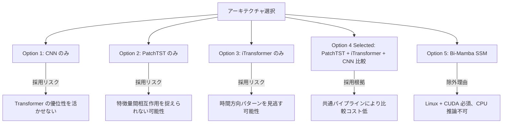

# ADR-0001: モデルアーキテクチャ選択（PatchTST / iTransformer / CNN）

## Status

Accepted

## Context

USDJPY 5分足方向予測 ML システム（Pearless）において、3クラス分類（UP/DOWN/NEUTRAL）を行うモデルアーキテクチャを選択する必要がある。

以前のシステムは 1 分足 CNN（HIGH 用・LOW 用の 2 モデル構成）で Accuracy 64〜78% を達成していたが、以下の課題があった。

- 短期ノイズの影響が大きく予測安定性に限界がある
- 2 モデル構成の運用コストが高い
- 特徴量間の動的な相互作用（例: RSI と CCI の同時極値）をモデル化できていない

本プロジェクトでは Kaggle GPU（NVIDIA T4、週 30 時間無料枠）での学習、ローカル WSL2 CPU での推論（50ms 未満）という実行環境の制約がある。

### 制約条件まとめ

| 項目 | 制約 |
|---|---|
| ローカル推論 | CPU のみ（WSL2）、50ms 未満/サンプル |
| パラメータ数 | 10M 以下（CPU 推論コスト） |
| 学習環境 | Kaggle GPU T4×2、週 30 時間 |
| フレームワーク | PyTorch 2.x |
| 入力形状 | (batch, 60, 16) 固定 |
| 出力 | (batch, 3) softmax |

---

## Decision

**PatchTST と iTransformer の両方を実装し、同一テストデータで比較評価した上で最終採用モデルを決定する。CNN ベースラインも実装し比較基準として使用する。**

### Decision Details

| Item | Content |
|------|---------|
| **Decision** | PatchTST と iTransformer の二択比較評価、CNN をベースラインとして使用 |
| **Why now** | 新規プロジェクト開始時点でアーキテクチャを確定する必要があるが、金融時系列分類タスクでどちらが優位かはデータ依存のため実験的決定が必要 |
| **Why this** | 両アーキテクチャは異なる帰納バイアス（時間軸 vs 特徴量軸 Attention）を持ち、USDJPY 5分足データに対してどちらが有効かは事前判断困難。共通パイプラインにより追加実装コストが低い |
| **Known unknowns** | USDJPY 5分足データにおける PatchTST vs iTransformer の性能差が不明。NEUTRAL クラスの過剰予測がどの程度発生するか未確認 |
| **Kill criteria** | いずれのモデルも CNN ベースラインの F1 スコアを 5 ポイント以上上回れない場合、アーキテクチャや特徴量設計を根本から見直す |

---

## Rationale

### Options Considered

#### Option 1: CNN のみ（既存踏襲）

- **Pros**:
  - 既存実装の知見をそのまま活用
  - CPU 推論が高速（パラメータ数が少ない）
  - 実装コストが低い
- **Cons**:
  - 長期依存関係（5 時間分のコンテキスト）を捉えにくい
  - 特徴量間の動的な相互作用をモデル化できない
  - 以前の実績（64〜78% Accuracy）から精度上限が見えている

#### Option 2: PatchTST のみ

- **Pros**:
  - パッチ化により局所パターン（30 分単位）とグローバル依存関係を両立
  - ICLR 2023 採択論文。時系列 Transformer の標準的な選択肢
  - RevIN による分布シフト対応
- **Cons**:
  - 特徴量間の相互作用（RSI と CCI の同時極値など）を直接モデル化しない
  - iTransformer が優位な可能性を事前に排除するリスク

#### Option 3: iTransformer のみ

- **Pros**:
  - 特徴量軸 Attention により 16 種のテクニカル指標間の動的相関を直接捕捉
  - ICLR 2024 Spotlight 採択。多変量時系列で SOTA 達成実績
  - テクニカル指標の「組み合わせシグナル」に理論的に強い
- **Cons**:
  - 時間方向の順序情報が埋め込み内に圧縮されるため、トレンド・モメンタムパターンの捕捉が間接的
  - PatchTST が優位な可能性を事前に排除するリスク

#### Option 4（採用）: PatchTST + iTransformer + CNN ベースライン 比較

- **Pros**:
  - 異なる帰納バイアスの 2 Transformer を実験的に比較できる
  - 共通パイプライン（同一 numpy 配列）により追加実装コストが限定的
  - CNN ベースラインとの比較でシステム全体の改善量を定量評価できる
  - データドリブンな最終選定が可能
- **Cons**:
  - 学習・評価コストが 3 モデル分（Kaggle GPU 時間消費）
  - 実装複雑度がやや上がる

#### Option 5: Bi-Mamba（SSM）

- **除外理由**: 公式 mamba-ssm パッケージが Linux + CUDA 必須。ローカル CPU 推論不可のため本プロジェクト対象外。

---

### 比較マトリクス

| 評価基準 | CNN | PatchTST | iTransformer | 重要度 |
|---|---|---|---|---|
| CPU 推論速度（50ms 以内） | ◎ | ○ | ○ | 高 |
| パラメータ数（10M 以下） | ◎ | ○ | ○ | 高 |
| 時間方向パターン捕捉 | ○ | ◎ | △ | 高 |
| 特徴量間相互作用捕捉 | △ | △ | ◎ | 高 |
| 長期依存関係（5時間） | △ | ◎ | ○ | 中 |
| 実装コスト | ◎ | ○ | ○ | 中 |
| 学術的な信頼性・実績 | ○ | ◎ ICLR 2023 | ◎ ICLR 2024 | 中 |
| Kaggle GPU 利用効率 | ◎ | ○ | ○ | 中 |

---

## Consequences

### Positive Consequences

- PatchTST と iTransformer の比較実験により、USDJPY 5分足データに最適なアーキテクチャを実証的に特定できる
- CNN ベースラインとの比較で「Transformer 移行の効果」を定量的に示せる
- 共通 numpy 配列パイプラインにより、モデルを差し替えても前処理コードを変更しない

### Negative Consequences

- 3 モデル実装・学習により Kaggle GPU 時間（週 30 時間）を相当量消費する
- モデルごとのチェックポイント管理が必要になる

### Neutral Consequences

- 最終採用モデルは Phase 3（評価完了後）に確定する。推論モジュールは選定モデルを差し替えられる抽象化が必要

---

## Architecture Impact

1. **変更コンポーネント**: `models/patchtst.py`、`models/itransformer.py`、`models/cnn.py`（新規作成）
2. **新規依存**: `torch`（CPU/GPU 共通）、RevIN の内部実装
3. **アーキテクチャ制約追加**:
   - 全モデルが共通インターフェース `forward(x: Tensor[B, T, F]) -> Tensor[B, 3]` を提供すること
   - 推論時は `model.eval()` + `torch.no_grad()` で実行すること
   - `device` 引数によりローカル CPU / Kaggle GPU を透過的に切り替えられること

---

## Implementation Guidance

- 全モデルに共通の `BaseModel` 抽象インターフェースを定義し、`forward()` シグネチャを統一する
- `device = torch.device("cuda" if torch.cuda.is_available() else "cpu")` パターンで環境透過的な実装にする
- モデルごとのパラメータ数を `sum(p.numel() for p in model.parameters())` で記録・検証する（上限 10M）
- RevIN は PatchTST のみに必須とし、iTransformer には適用しない。iTransformer の forward メソッドでは RevIN なしで直接転置操作（B,60,16）→（B,16,60）を行う
- 学習設定（CrossEntropyLoss 重み付き、AdamW、CosineAnnealingWarmRestarts）は全モデル共通の `training.py` に集約する

---

## Related Information

- ADR-0002: テクニカル指標ライブラリ選択（pandas-ta vs TA-Lib）
- PRD: `/home/nomu/claude_code/pearless/docs/prd.md`
- 設計書: `/home/nomu/claude_code/pearless/fx_prediction_design_v3.md`
- PatchTST 論文: [A Time Series is Worth 64 Words: Long-term Forecasting with Transformers (ICLR 2023)](https://arxiv.org/abs/2211.14730)
- iTransformer 論文: [iTransformer: Inverted Transformers Are Effective for Time Series Forecasting (ICLR 2024)](https://proceedings.iclr.cc/paper_files/paper/2024/file/2ea18fdc667e0ef2ad82b2b4d65147ad-Paper-Conference.pdf)
- thuml/iTransformer GitHub: https://github.com/thuml/iTransformer
- 金融時系列分類比較研究（2024）: [A Comparative Study of Transformer-Based and Classical Models for Financial Time-Series Forecasting](https://www.mdpi.com/1911-8074/19/3/203)
