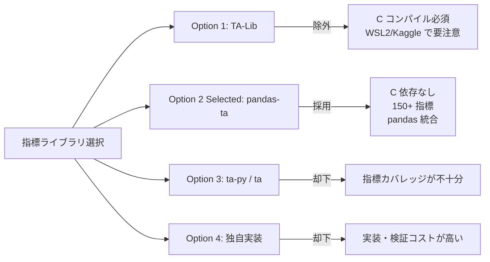

# ADR-0002: テクニカル指標ライブラリ選択（pandas-ta vs TA-Lib vs その他）

## Status

Accepted

## Context

Pearless プロジェクトでは 16 種のテクニカル指標（MA、CCI、RSI、VWAP、ボリンジャーバンド、MACD、ATR 等）を pandas DataFrame から計算する必要がある。

実行環境は WSL2 Ubuntu（ローカル）と Kaggle Notebooks（クラウド）の 2 環境があり、環境の違いを吸収した統一的な計算が要求される。

### 制約条件

- C 言語のネイティブコンパイルに依存するライブラリは、WSL2 + uv / Kaggle の両環境でのインストール難易度が高い
- `uv sync` 一コマンドで完全再現可能な環境を提供する必要がある（AC-024）
- Kaggle では `requirements.txt` 経由でインストールされる
- 実験管理ツール（wandb）はスコープ外と確定しており、新たな外部サービス依存は最小化する

---

## Decision

**pandas-ta を採用する。TA-Lib および他の C 依存ライブラリは除外する。**

### Decision Details

| Item | Content |
|------|---------|
| **Decision** | pandas-ta を採用、TA-Lib は除外 |
| **Why now** | `pyproject.toml` / `uv.lock` 作成時点でライブラリを確定する必要がある |
| **Why this** | C 依存なしで WSL2 + Kaggle 両環境に `uv sync` / `pip install` で即インストール可能。CCI・RSI・VWAP・BB・MACD・ATR・MA を含む必要な 16 指標を全てカバーしている |
| **Known unknowns** | pandas-ta の一部指標で大規模 DataFrame（75 万行）処理時にパフォーマンスが問題になる可能性がある |
| **Kill criteria** | pandas-ta でカバーできない指標が必要になった場合、またはパイプライン処理時間が 30 分を超えた場合 |

---

## Rationale

### Options Considered

#### Option 1: TA-Lib

- **Pros**:
  - 200 以上の指標を持つ業界標準ライブラリ
  - C 実装による高速演算
  - 豊富な実績・コミュニティサポート
- **Cons**:
  - C ライブラリのコンパイルまたはバイナリのインストールが必要
  - WSL2 / Kaggle の環境によっては追加の依存解決が必要
  - `uv sync` 一コマンド再現の妨げになる可能性
  - PRD で「TA-Lib は C 依存のため除外」と明記されている（AC-024）

#### Option 2（採用）: pandas-ta

- **Pros**:
  - 純粋な Python / NumPy 実装、C コンパイル不要
  - 150 以上の指標を網羅（本プロジェクト必要な全 16 指標を含む）
  - pandas DataFrame に直接 `.ta` accessor でアクセス可能
  - WSL2 / Kaggle 両環境で `pip install pandas-ta` のみ
  - `uv add pandas-ta` で `uv.lock` に固定可能
- **Cons**:
  - pandas DataFrame ベースの処理でベクトル演算効率は TA-Lib より低い場合がある
  - 大規模データ（75 万行）での全指標一括計算では処理時間の確認が必要

#### Option 3: ta-py / ta

- **Pros**: 軽量、C 依存なし
- **Cons**: 指標カバレッジが pandas-ta より限定的。VWAP・BB%B・ATR を全て網羅しているかの確認が必要。コミュニティが小さい

#### Option 4: 独自実装

- **Pros**: 依存ゼロ、完全制御可能
- **Cons**: 16 指標全てを NumPy で正確に実装・検証するコストが大きい。バグリスクが高い

---

### 16 指標カバレッジ確認

| # | 指標名 | pandas-ta API | TA-Lib |
|---|---|---|---|
| 1 | MA60乖離率 | `ta.sma(close, length=60)` | SMA |
| 2 | 天井度 | `close.rolling(60).max()` | MAX |
| 3 | MA20 | `ta.sma(close, length=20)` | SMA |
| 4 | MA10 | `ta.sma(close, length=10)` | SMA |
| 5 | 前足比 | `close.pct_change()` | なし（自前計算） |
| 6 | 曜日 | `df.index.dayofweek` | なし |
| 7 | HLO | `high - low` | なし |
| 8 | diff_HLO_and_Average | `(high - low) - (high - low).rolling(N).mean()` | なし |
| 9 | CCI(20) | `ta.cci(high, low, close, length=20)` | CCI |
| 10 | RSI(9) | `ta.rsi(close, length=9)` | RSI |
| 11 | 振れ幅 | `(high - open).abs()` or `(open - low).abs()` | なし |
| 12 | VWAP乖離率 | `ta.vwap(high, low, close, volume)` | なし |
| 13 | BB%B | `ta.bbands(close, length=20)` の `%B` | BBANDS |
| 14 | MACDヒストグラム | `ta.macd(close)` の `MACDh` | MACD |
| 15 | ATR(14) | `ta.atr(high, low, close, length=14)` | ATR |
| 16 | 時間帯sin/cos | `np.sin / np.cos` + `df.index.hour * 12 + df.index.minute // 5` | なし |

全 16 指標を pandas-ta + NumPy で実装可能であることを確認。

### 改訂 2026-06-10: 価格レベル系特徴量の定常化

学習済みモデルの診断で、生の価格水準（円）を持つ特徴量が train/test 期間の
価格レンジ差により深刻な分布シフトを起こすことが実測された
（StandardScaler 正規化後の test 平均が ma10/ma20/天井度で +4.2σ）。
以下の通り全特徴量を比率・乖離率に変更する（実装は `models/configs.py` の
`ALL_FEATURES` を正準とする）:

| 旧 | 新 | 新定義 |
|---|---|---|
| 天井度 ceiling_degree | ceiling_distance | `(close.rolling(60).max() - close) / close` |
| MA20 ma20 | ma20_deviation | `(close - MA20) / MA20` |
| MA10 ma10 | ma10_deviation | `(close - MA10) / MA10` |
| HLO hlo | hlo_ratio | `(high - low) / close` |
| 振れ幅 swing | swing_ratio | `abs(high - open) / close` |
| ATR(14) atr | atr_ratio | `ATR(14) / close` |

diff_HLO_and_Average は hlo_ratio ベース（`hlo_ratio - hlo_ratio.rolling(14).mean()`）に変更。

---

## Consequences

### Positive Consequences

- `uv sync` 一コマンドで WSL2 / Kaggle 両環境に完全再現可能
- pandas DataFrame との統合が自然で、パイプラインコードの可読性が高い
- C コンパイルエラーという環境依存の問題が発生しない

### Negative Consequences

- 大規模データ（75 万行）での全指標一括計算は、TA-Lib より遅い可能性がある
- パイプライン処理時間（目標 30 分以内）の達成確認が実装後の検証項目になる

### Neutral Consequences

- `ta.` accessor を使うか個別関数呼び出しを使うかは実装の詳細（Design Doc で決定）
- 将来的に新しい指標が必要になった場合も pandas-ta で対応可能であれば追加コストが低い

---

## Architecture Impact

1. **変更コンポーネント**: `pipeline.py` の `feature_engineering()` 関数
2. **新規依存**: `pandas-ta`（`pyproject.toml` の `dependencies` に追加）
3. **アーキテクチャ制約追加**:
   - 指標計算は全て pandas DataFrame 上で行い、NumPy への変換はウィンドウ化ステップで行う
   - pandas-ta の返す列名（例: `SMA_60`、`CCI_20_0.015`）はバージョン間で変わる可能性があるため、計算後に標準列名へリネームする

---

## Implementation Guidance

- `feature_engineering(df: pd.DataFrame) -> pd.DataFrame` として特徴量計算を単一関数に集約する
- pandas-ta の列名は固定しないこと。返却 DataFrame の列名を明示的に `FEATURE_NAMES` リストに合わせてリネームする
- `pandas-ta` のバージョンを `pyproject.toml` で固定し、`uv.lock` に記録することで再現性を保証する
- 指標計算後に先頭 NaN 行をドロップする処理（`df.dropna()`）を `feature_engineering()` の末尾で必ず実行する

---

## Related Information

- ADR-0001: モデルアーキテクチャ選択
- PRD: `/home/nomu/claude_code/pearless/docs/prd.md`（AC-024、AC-025）
- [pandas-ta PyPI](https://pypi.org/project/pandas-ta/)
- [TA-Lib vs pandas-ta 比較](https://www.slingacademy.com/article/comparing-ta-lib-to-pandas-ta-which-one-to-choose/)
- [pandas-ta GitHub](https://github.com/aarigs/pandas-ta)
