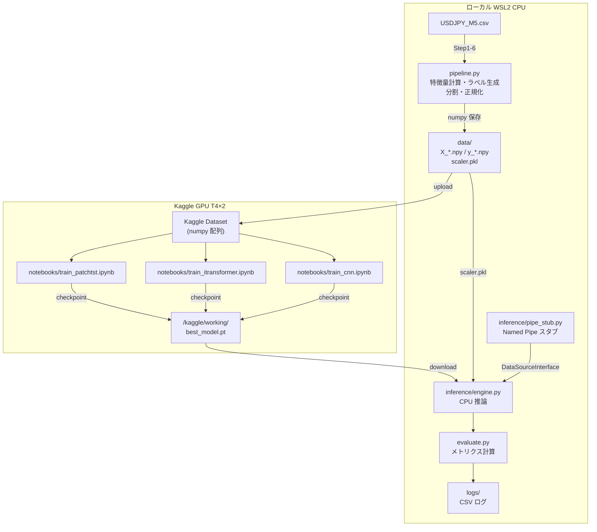

# USDJPY 5分足方向予測 ML システム（Pearless）Design Document

## Overview

USDJPY 5分足 OHLCV データから次の 5 分足の方向（UP/DOWN/NEUTRAL）を予測する ML システムを新規構築する。共通データパイプライン（16 特徴量計算・ラベル生成・時系列分割・正規化）をローカル（WSL2 CPU）で実行し、Kaggle GPU で PatchTST / iTransformer / CNN の 3 モデルを学習・比較評価し、最良モデルをローカル CPU で推論する。Named Pipe スタブにより MT4 との将来連携インターフェースを確立する。

---

## Design Summary (Meta)

```yaml
design_type: "new_feature"
risk_level: "high"
complexity_level: "high"
complexity_rationale: |
  (1) ACs AC-001〜AC-020（MVP 必須）にわたる複数コンポーネントの連携が必要。
      特に AC-003/AC-004 のデータリーク防止、AC-009〜AC-012 のモデル寸法整合性、
      AC-017 のリアルタイム推論レイテンシ制約が技術的難易度を上げる。
  (2) ローカル CPU / Kaggle GPU 環境切り替え、Kaggle commit mode 対応、
      Named Pipe 抽象化という 3 つの実行環境制約が並行して設計を制約する。
main_constraints:
  - "PyTorch: ローカルは CPU 版、Kaggle は GPU 版（同一コードで device 切り替え）"
  - "依存管理: uv + pyproject.toml で WSL2/Kaggle 完全再現"
  - "実験管理: wandb 禁止、CSV ログのみ"
  - "指標ライブラリ: ta ライブラリ（ta>=0.11.0）を使用。pandas-ta は llvmlite/numba 依存によりビルド失敗のため ta に変更（ユーザー承認済み）。TA-Lib 禁止は継続"
  - "パラメータ上限: 10M 以下（CPU 推論 50ms 制約）"
  - "学習環境: Kaggle T4 GPU、週 30 時間制限"
biggest_risks:
  - "NEUTRAL クラス過剰予測（クラス不均衡）"
  - "scaler.pkl の学習時/推論時不整合"
  - "NaN 処理ミスによるデータリーク"
unknowns:
  - "USDJPY 5分足データにおける PatchTST vs iTransformer の実性能差"
  - "75万行の全指標計算で 30 分以内に収まるか（ta ライブラリパフォーマンス）"
```

---

## Background and Context

### Prerequisite ADRs

- **ADR-0001-model-architecture-selection.md**: PatchTST / iTransformer / CNN の三択比較評価を行い Phase 3 で最終選定する。全モデルが共通インターフェース `forward(x)` を提供する
- **ADR-0002-technical-indicator-library.md**: ta ライブラリ（ta>=0.11.0）を採用。pandas-ta は llvmlite/numba 依存によりビルド失敗のため変更（ユーザー承認済み）。TA-Lib は C 依存のため除外は継続。16 指標の API マッピングを定義

---

### Agreement Checklist

#### Scope

- [x] データパイプライン（CSV 読み込み → 16 特徴量計算 → ラベル生成 → ウィンドウ化 → 時系列分割 → 正規化 → numpy 保存）
- [x] PatchTST モデル実装（PyTorch）+ Kaggle 学習ノートブック
- [x] iTransformer モデル実装（PyTorch）+ Kaggle 学習ノートブック
- [x] CNN ベースライン実装（比較用）
- [x] 評価モジュール（Accuracy / F1 / Precision / AUC-ROC / 高信頼度的中率 / 推論時間）
- [x] ローカル CPU 推論モジュール（50ms 未満）
- [x] Named Pipe スタブ（DataSourceInterface 抽象化）
- [x] Kaggle Dataset アップロードスクリプト（CLI）
- [x] 学習ログ CSV 出力
- [x] uv プロジェクト構成（pyproject.toml / uv.lock）

#### Non-Scope（明示的に対象外）

- [x] wandb 連携（PRD で確定済みスコープ外。コードに一切含めない）
- [x] MT4 本番 Named Pipe 連携（スタブのみ）
- [x] M1→M5 集約（M5 CSV から直接開始）
- [x] Web UI / ダッシュボード
- [x] リアルタイムデータフィード
- [x] Bi-Mamba（SSM）モデル
- [x] 自動バックテスト基盤

#### Constraints

- [x] 並行動作: 不要（ローカル単一プロセス）
- [x] 後方互換性: 不要（新規プロジェクト）
- [x] パフォーマンス計測: 必要（推論 50ms、パイプライン 30 分、Kaggle 1 エポック 5 分）
- [x] データリーク防止: Scaler は train データのみで fit（AC-003, AC-004）
- [x] 冪等性保証: 同一 CSV → 同一 numpy 配列（SHA-256 検証）

#### Applicable Standards

- [x] Python 3.12 `[explicit]` — Source: pyproject.toml `requires-python = ">=3.12"`
- [x] PyTorch 2.x CPU/GPU 共通コード `[explicit]` — Source: PRD Technical Considerations
- [x] ta ライブラリ（ta>=0.11.0、TA-Lib 禁止）`[explicit]` — Source: pyproject.toml、ADR-0002（pandas-ta からの変更承認済み）
- [x] uv による依存管理 `[explicit]` — Source: PRD AC-024、AC-025
- [x] wandb 禁止 `[explicit]` — Source: PRD Won't Have 節
- [x] any 型使用禁止 `[implicit]` — Evidence: CLAUDE.md
- [x] let 回避・immutable 設計 `[implicit]` — Evidence: CLAUDE.md（Python では再代入・ミュータブル操作を避ける）
- [x] クラス番号固定 UP=0 / DOWN=1 / NEUTRAL=2 `[explicit]` — Source: PRD Glossary

#### Quality Assurance Mechanisms

- [x] パイプライン冪等性（SHA-256 検証）— Enforces: 同一 CSV 入力 → 同一 numpy 出力 — Status: `adopted`
- [x] uv sync 完全再現 — Enforces: 環境再現性 — Status: `adopted`
- [x] スタブ連続 100 回推論エラーゼロ — Enforces: 推論エンジン安定性（AC-019）— Status: `adopted`
- [x] パイプライン各ステップ後のアサーション（shape・NaN 数・クラス分布）— Enforces: データ品質・リーク防止 — Status: `adopted`
- [x] モデルパラメータ数チェック（10M 以下）— Enforces: CPU 推論コスト制約 — Status: `adopted`

---

### Problem to Solve

1 分足 CNN（2 モデル構成）の精度限界（Accuracy 64〜78%）と運用コスト課題を解消し、最新の Transformer 系アーキテクチャで 5 分足データの方向予測精度を向上させる。Kaggle GPU 無料枠を活用した費用ゼロの学習パイプラインを整備し、Named Pipe スタブで MT4 との将来連携インターフェースを確立する。

### Current Challenges

- 以前の CNN は特徴量間の動的な相互作用（複数テクニカル指標のコンビネーション）をモデル化できていない
- 2 モデル構成（HIGH / LOW 別）の管理コストが高い
- GPU 学習環境のセットアップコストが高く、再現性が低い

---

### Requirements

#### Functional Requirements

- 16 特徴量計算（ta ライブラリ + NumPy、NaN なし出力）
- 3 クラスラベル生成（閾値自動決定 + 外部指定可能）
- 時系列分割（train 70% / val 15% / test 15%、順序保持、リークなし）
- PatchTST 実装: (B, 60, 16) → (B, 3) softmax、RevIN 必須
- iTransformer 実装: (B, 60, 16) → 転置 → (B, 16, 60) → (B, 3) softmax
- 評価モジュール: 全メトリクス CSV 出力
- ローカル CPU 推論: 50ms 未満/サンプル
- Named Pipe スタブ: DataSourceInterface 抽象化、差し替え可能
- Kaggle 学習ノートブック: commit mode 対応

#### Non-Functional Requirements

- **Performance**: 推論 50ms 未満/サンプル（WSL2 CPU）、パイプライン処理 30 分以内（750,000 行）、Kaggle 1 エポック 5 分以内（T4）
- **Scalability**: 特徴量数（16）・ウィンドウ長（60）・クラス数（3）を設定値として変更可能
- **Reliability**: パイプライン冪等性（SHA-256）、スタブ連続 100 回エラーゼロ
- **Maintainability**: 全モデルが共通インターフェースを実装、設計書との対応をコメントで明示

---

## Acceptance Criteria (AC) - EARS Format

### データパイプライン

- [x] **AC-001** パイプライン実行時、`X_train.npy`, `y_train.npy`, `X_val.npy`, `y_val.npy`, `X_test.npy`, `y_test.npy`, `scaler.pkl` が正常に生成される
- [x] **AC-002** 生成される numpy 配列の入力形状が `(N, 60, 16)` であること（N はサンプル数）
- [x] **AC-003** 時系列分割が train 70% / val 15% / test 15% の順序分割で行われ、val/test データがいずれも train データより時系列的に後であること
- [x] **AC-004** `StandardScaler` の `fit` が train データのみに対して実行され、val / test には `transform` のみが適用されること（`scaler.pkl` が `data/` ディレクトリに保存されること）

### 16 特徴量計算

- [x] **AC-005** 全 16 特徴量が NaN なしで計算完了すること（先頭 NaN 行はドロップ済みであること）
- [x] **AC-006** 時間帯特徴量が sin/cos エンコーディング（周期 288 = 1 日の 5 分足本数）で実装されること

### ラベル生成

- [x] **AC-007** **When** threshold が指定されない場合、the system shall 閾値 θ を `diff.abs().quantile(0.75)` で自動決定し、上位 25% が UP(0) または DOWN(1) に分類され残り 75% が NEUTRAL(2) となること
- [x] **AC-008** **If** threshold が外部から指定された場合、**then** the system shall その値を閾値として使用し、デフォルト計算をスキップすること

### PatchTST モデル

- [x] **AC-009** 入力テンソル shape `(batch, 60, 16)` を受け取り、出力 shape `(batch, 3)` の softmax 確率が正常に出力されること
- [x] **AC-010** RevIN（Reversible Instance Normalization）モジュールが PatchTST に組み込まれていること

### iTransformer モデル

- [x] **AC-011** 入力テンソル shape `(batch, 60, 16)` を受け取り、出力 shape `(batch, 3)` の softmax 確率が正常に出力されること
- [x] **AC-012** 転置操作 `(batch, 60, 16)` → `(batch, 16, 60)` が forward メソッド内で行われること

> **注記（RevIN 非適用）**: iTransformer に RevIN は適用しない。ADR-0001 Implementation Guidance に記載の通り「RevIN は PatchTST のみに必須」であり、iTransformer の forward メソッドには RevIN 処理を含めないこと。

### Kaggle 学習ノートブック

- [x] **AC-013** `/kaggle/working/` にエポックごとのチェックポイントが保存されること
- [x] **AC-014** commit mode（Save & Run All）で実行完了できること

### 評価モジュール

- [x] **AC-015** テストデータに対して全メトリクス（Accuracy・F1(UP/DOWN)・Precision(UP/DOWN)・AUC-ROC・高信頼度的中率）が CSV ファイルに出力されること
- [x] **AC-016** **If** `--threshold` オプションが指定された場合、**then** the system shall 高信頼度的中率の計算閾値としてその値を使用すること（デフォルト 0.8）

### ローカル CPU 推論

- [x] **AC-017** 1 サンプルあたりの推論時間が 50ms 未満であること（`time.perf_counter` での 100 回平均計測、WSL2 CPU 環境）
- [x] **AC-018** 推論結果としてシグナル（"UP" / "DOWN" / "NEUTRAL"）と UP/DOWN/NEUTRAL 各確率値が出力されること

### Named Pipe スタブ

- [x] **AC-019** スタブが 5 分足 60 本分のダミー OHLCV データを生成し、推論エンジンに渡して UP/DOWN/NEUTRAL シグナルを返せること
- [x] **AC-020** `DataSourceInterface` を継承するクラスを差し替えることで実 Named Pipe へ切り替えられること（インターフェース変更なし）

### CNN ベースライン

- [x] **AC-021** 全メトリクスが PatchTST / iTransformer と同一 CSV レポートに出力され、CNN 列が欠損なく存在すること

### 学習ログ CSV

- [x] **AC-022** `logs/training_log_{model_name}_{timestamp}.csv` に出力されること
- [x] **AC-023** 学習中断・再開時に中断前の CSV に新しいエポック行が追記され、再開後のエポック行が中断前の最終行より後ろに追記され、行数が増加していること

### uv プロジェクト構成

- [x] **AC-024** `uv sync` 一コマンドで全依存関係がインストールされること
- [x] **AC-025** `uv export --format requirements-txt` で Kaggle 向け `requirements.txt` が生成できること

### Kaggle Dataset アップロード

- [x] **AC-026** `scripts/upload_dataset.py` を実行することで、`data/` ディレクトリの numpy 配列（`X_*.npy`、`y_*.npy`、`scaler.pkl`）が Kaggle Dataset として公開されること。アップロード完了後に Kaggle Dataset ページへのURLがコンソールに出力されること

---

## Existing Codebase Analysis

### Implementation Path Mapping

| Type | Path | Description |
|------|------|-------------|
| New | `pipeline.py` | メインデータパイプライン（特徴量計算・ラベル生成・分割・正規化・numpy 保存） |
| New | `models/__init__.py` | モデルパッケージ |
| New | `models/base.py` | BaseModel 抽象クラス（共通インターフェース） |
| New | `models/patchtst.py` | PatchTST 実装 |
| New | `models/itransformer.py` | iTransformer 実装 |
| New | `models/cnn.py` | CNN ベースライン実装 |
| New | `models/training.py` | 共通学習ループ（CrossEntropyLoss・AdamW・CosineAnnealing） |
| New | `evaluate.py` | 評価モジュール |
| New | `inference/engine.py` | ローカル CPU 推論エンジン |
| New | `inference/interface.py` | DataSourceInterface 抽象クラス |
| New | `inference/pipe_stub.py` | Named Pipe スタブ実装 |
| New | `scripts/upload_dataset.py` | Kaggle Dataset アップロード CLI |
| New | `notebooks/train_patchtst.ipynb` | PatchTST Kaggle 学習ノートブック |
| New | `notebooks/train_itransformer.ipynb` | iTransformer Kaggle 学習ノートブック |
| New | `notebooks/train_cnn.ipynb` | CNN Kaggle 学習ノートブック |
| New | `pyproject.toml` | uv プロジェクト設定 |
| New | `data/` | numpy 配列保存ディレクトリ（.gitignore 対象） |
| New | `logs/` | 学習ログ CSV 保存ディレクトリ |

### Integration Points（新規実装でも接続点を明示）

- **Kaggle Dataset**: `scripts/upload_dataset.py` → Kaggle API（`kaggle` CLI 経由）
- **Kaggle Notebooks**: `data/` ディレクトリの numpy 配列 → Kaggle Dataset → ノートブックで読み込み
- **推論エンジン ↔ スタブ**: `DataSourceInterface.fetch_latest_ohlcv()` を通じて疎結合

### Code Inspection Evidence

| File/Function | Relevance |
|---|---|
| `fx_prediction_design_v3.md:create_label()` | ラベル生成ロジックの参照実装（similar functionality） |
| `fx_prediction_design_v3.md:save_checkpoint()` | Kaggle チェックポイント保存パターン（pattern reference） |
| `fx_prediction_design_v3.md:aggregate_to_m5()` | M1→M5 集約（本プロジェクトスコープ外だが参考） |

> **注記（wandb 方針の断絶）**: 設計書 v3（`fx_prediction_design_v3.md`）には wandb による実験管理を推奨する記述が含まれているが、本設計書では PRD の Won't Have 決定に従い wandb を完全に除外している。設計書 v3 の wandb 推奨記述は採用しない（代替: CSV ログのみ）。

### Fact Disposition Table

| Fact ID | Focus Area | Disposition | Rationale | Evidence |
|---|---|---|---|---|
| `pipeline.py:create_label` | ラベル生成関数とクラス番号定義 | preserve | 設計書の仕様をそのまま実装する。閾値自動決定（quantile(0.75)）とクラス番号（UP=0, DOWN=1, NEUTRAL=2）は PRD で確定済み | `create_label(df, horizon=1, threshold=None); デフォルト閾値: diff.abs().quantile(0.75); クラス番号固定: UP=0, DOWN=1, NEUTRAL=2; 外部から閾値指定可能; 上位25%のみUP/DOWN分類` |
| `pipeline.py:feature_engineering` | 16特徴量計算の実装仕様 | preserve | 16 特徴量の順序・名称・API マッピングを ADR-0002 で確定。ta ライブラリを使用し先頭 NaN 行をドロップする | `16特徴量の順序と名称: [MA60乖離率, 天井度(ceiling_degree), MA20, MA10, 前足比, HLO, diff_HLO_and_Average, CCI(20), RSI(9), 振れ幅, VWAP乖離率, BB%B(BB(20)), MACDヒストグラム, ATR(14), 時間帯sin, 時間帯cos]; ta ライブラリ使用; 先頭NaN行をドロップ; dayofweekは削除済み` |
| `pipeline.py:split_and_normalize` | 時系列分割と正規化のデータリーク防止 | preserve | train 70% / val 15% / test 15% 順序分割と train-only Scaler fit は AC-003/AC-004 で確定。冪等性は SHA-256 で検証 | `train 70% / val 15% / test 15%（順序分割）; Scalerのfitはtrainのみ; scaler.pkl保存; 冪等性保証` |
| `models/patchtst.py:PatchTST` | PatchTSTアーキテクチャの寸法整合性 | preserve | 入力(B,60,16)→パッチ→Linear(96→128)→Transformer→Dense(3)→softmax の寸法を設計書仕様のまま実装。RevIN と学習可能位置エンコーディングも実装 | `入力(batch, 60, 16) → パッチ分割(batch, 10, 96) → Linear(96→128) → Transformer → Dense(3)→softmax; RevIN必須; 位置エンコーディングは学習可能` |
| `models/itransformer.py:iTransformer` | iTransformerの転置操作と特徴量軸Attention | preserve | 転置(B,60,16)→(B,16,60)→Linear(60→128)→Transformer→MeanPool→Dense(3)→softmax を設計書仕様のまま実装 | `入力(batch, 60, 16) → 転置(batch, 16, 60) → Linear(60→128) → Transformer(特徴量間Attention) → MeanPool → Dense(3)→softmax` |
| `models/training.py:training_loop` | 学習ループ共通設定 | preserve | CrossEntropyLoss（クラス重み付き）・AdamW(lr=1e-4)・CosineAnnealingWarmRestarts(T_0=10)・batch=256・max_epochs=100・early_stopping=15 を共通 training.py に集約 | `CrossEntropyLoss(クラス重み付き); AdamW(lr=1e-4, weight_decay=1e-4); CosineAnnealingWarmRestarts(T_0=10); batch=256, max_epochs=100, early_stopping=15エポック; CSVログ` |
| `evaluate.py` | 評価モジュール | preserve | Accuracy, F1(UP/DOWN), Precision, AUC-ROC, 高信頼度的中率(prob>0.8), CSV 出力を設計書仕様のまま実装 | `Accuracy, F1(UP/DOWN), Precision, AUC-ROC, 高信頼度的中率(prob>0.8); CSV出力` |
| `inference/pipe_stub.py` | Named Pipeスタブ | preserve | DataSourceInterface による抽象化とスタブのダミーデータ生成を実装。切り替え可能構造は AC-020 で確定 | `DataSourceInterfaceによる抽象化; スタブはダミーOHLCVデータ生成; 切り替え可能構造` |
| `pyproject.toml` | uvプロジェクト構成 | preserve | Python 3.12、torch CPU 版、ta>=0.11.0 を指定。wandb 禁止、TA-Lib 禁止は明示的にコメントで記録 | `Python 3.12; torch CPU版; ta>=0.11.0; wandb禁止; TA-Lib禁止; uv sync完全再現` |

---

## Design

### Change Impact Map

```yaml
Change Target: 新規プロジェクト全体（既存コードなし）

Direct Impact:
  - pipeline.py (新規: メインパイプライン)
  - models/patchtst.py (新規)
  - models/itransformer.py (新規)
  - models/cnn.py (新規)
  - models/training.py (新規: 共通学習ループ)
  - evaluate.py (新規)
  - inference/engine.py (新規)
  - inference/interface.py (新規: DataSourceInterface)
  - inference/pipe_stub.py (新規)
  - pyproject.toml (新規)

Indirect Impact:
  - data/ (pipeline.py の出力先)
  - logs/ (training.py の出力先)
  - notebooks/*.ipynb (models/ と data/ に依存)
  - scripts/upload_dataset.py (data/ に依存)

No Ripple Effect:
  - 既存システム（1分足CNN）: 独立プロジェクトのため影響なし
  - MT4 本番連携: Named Pipe スタブのみ、本番実装はスコープ外
```

### Interface Change Matrix

| Existing | New | Conversion Required | Compatibility Method |
|---|---|---|---|
| なし（新規） | `BaseModel.forward(x: Tensor) -> Tensor` | N/A | — |
| なし（新規） | `DataSourceInterface.fetch_latest_ohlcv() -> pd.DataFrame` | N/A | — |
| なし（新規） | `pipeline.run(csv_path: str, output_dir: str) -> None` | N/A | — |

---

### Architecture Overview



---

### Data Flow

```
[入力] USDJPY_M5.csv
  | datetime, open, high, low, close, volume (6 列)
  ↓
[Step 1] feature_engineering(df)
  | ta ライブラリで 16 テクニカル指標を計算
  | 先頭 NaN 行をドロップ
  | → DataFrame (N_raw, 16)
  | Assert: NaN 数 == 0, shape[1] == 16
  ↓
[Step 2] create_label(df, horizon=1, threshold=None)
  | diff = future_close - close
  | threshold = diff.abs().quantile(0.75) if None
  | labels: UP=0, DOWN=1, NEUTRAL=2
  | → ndarray (N_raw,) dtype=int64
  | Assert: クラス分布確認（NEUTRAL が約 75%）
  ↓
[Step 3] create_windows(features, labels, window_size=60)
  | スライディングウィンドウ (stride=1)
  | → X: (N_win, 60, 16), y: (N_win,)
  | 最後の horizon 行は y が NaN のため除外
  ↓
[Step 4] split_time_series(X, y, ratios=[0.70, 0.15, 0.15])
  | 時系列順で分割（シャッフルなし）
  | → (X_train, y_train), (X_val, y_val), (X_test, y_test)
  | Assert: len(X_train) + len(X_val) + len(X_test) == N_win
  ↓
[Step 5] normalize(X_train, X_val, X_test)
  | StandardScaler.fit(X_train_reshaped)  ← train のみ fit
  | scaler.transform(X_*)
  | scaler を data/scaler.pkl に保存
  ↓
[出力] data/ ディレクトリ
  | X_train.npy (N_train, 60, 16)
  | y_train.npy (N_train,)
  | X_val.npy   (N_val,   60, 16)
  | y_val.npy   (N_val,)
  | X_test.npy  (N_test,  60, 16)
  | y_test.npy  (N_test,)
  | scaler.pkl  (StandardScaler)
  | SHA-256 ハッシュ検証で冪等性確認

[Kaggle 学習フロー]
  data/ → Kaggle Dataset → notebooks/*.ipynb
  → CrossEntropyLoss(weight=class_weights) + AdamW + CosineAnnealing
  → best_model.pt (/kaggle/working/ に保存)

[推論フロー（ローカル CPU）]
  DataSourceInterface.fetch_latest_ohlcv()  ← スタブ or 実 MT4
  → 直近 60 本 OHLCV DataFrame
  → feature_engineering()  ← 推論用（同一関数）
  → scaler.transform()     ← scaler.pkl をロード
  → model.forward(x)       ← best_model.pt をロード
  → argmax → "UP" / "DOWN" / "NEUTRAL" + 確率 3 値
  （注: 設計書 v3 では "NEUTRAL" を "NOENTRY" と記載している箇所があるが、PRD Glossary 準拠で "NEUTRAL" を正式名称とする）
```

---

### Integration Points List

| Integration Point | Location | Old Implementation | New Implementation | Switching Method | Verification Method |
|---|---|---|---|---|---|
| データソース切り替え | `inference/engine.py` | なし | `DataSourceInterface` 抽象 | サブクラス差し替え（DI） | スタブで 100 回連続推論エラーゼロ確認（AC-019） |
| Kaggle Dataset 連携 | `scripts/upload_dataset.py` | なし | `kaggle datasets create` CLI | — | アップロード後に Dataset ページで確認 |
| モデル切り替え | `inference/engine.py` | なし | `BaseModel` 抽象クラス | `--model` 引数でクラス選択 | 同一入力で全モデルの出力 shape を確認 |

---

### Main Components

#### BaseModel（`models/base.py`）

- **Responsibility**: 全モデル共通インターフェースの定義。入出力の shape 契約を保証する
- **Interface**:
  ```python
  class BaseModel(nn.Module):
      def forward(self, x: torch.Tensor) -> torch.Tensor:
          """
          x: (batch_size, seq_len, n_features) = (B, 60, 16)
          returns: (batch_size, n_classes) = (B, 3), softmax 済み
          """
          raise NotImplementedError
  ```
- **Dependencies**: `torch.nn.Module`

#### PatchTST（`models/patchtst.py`）

- **Responsibility**: パッチ化 Transformer による時間方向パターン学習
- **Interface**: `BaseModel.forward()` を実装
- **Dependencies**: `BaseModel`、RevIN（同ファイル内クラス）
- **主要ハイパーパラメータ**: `seq_len=60`, `n_features=16`, `patch_len=6`, `stride=6`, `d_model=128`, `n_heads=8`, `n_layers=3`, `dim_ff=256`, `dropout=0.2`, `n_classes=3`
- **パラメータ数目安**: 約 2〜3M（10M 制約を満たす）

#### iTransformer（`models/itransformer.py`）

- **Responsibility**: 特徴量軸 Attention による指標間相互作用学習
- **Interface**: `BaseModel.forward()` を実装
- **Dependencies**: `BaseModel`
- **主要ハイパーパラメータ**: `seq_len=60`, `n_features=16`, `d_model=128`, `n_heads=8`, `n_layers=3`, `dim_ff=256`, `dropout=0.2`, `n_classes=3`
- **パラメータ数目安**: 約 2〜3M（10M 制約を満たす）
- **RevIN**: 適用しない。ADR-0001 の Implementation Guidance に従い、RevIN は PatchTST のみに必須とする。iTransformer の forward メソッドには RevIN 処理を含めないこと（転置操作は RevIN なしで直接 `(B, 60, 16) → (B, 16, 60)` を実施する）

#### DataSourceInterface（`inference/interface.py`）

- **Responsibility**: データ取得方法の抽象化（スタブ / 実 Named Pipe の差し替えを可能にする）
- **Interface**:
  ```python
  from abc import ABC, abstractmethod
  import pandas as pd

  class DataSourceInterface(ABC):
      @abstractmethod
      def fetch_latest_ohlcv(self, n_bars: int = 60) -> pd.DataFrame:
          """
          直近 n_bars 本の OHLCV を返す。
          columns: ['datetime', 'open', 'high', 'low', 'close', 'volume']
          """
          ...
  ```
- **Dependencies**: `abc.ABC`

#### NamedPipeStub（`inference/pipe_stub.py`）

- **Responsibility**: MT4 なしでの推論フロー動作確認用ダミーデータ生成
- **Interface**: `DataSourceInterface` を継承
- **Dependencies**: `DataSourceInterface`、`numpy`、`pandas`

#### 推論エンジン（`inference/engine.py`）

- **Responsibility**: scaler.pkl ロード、特徴量計算、正規化、モデル推論を一元管理。推論時間計測も担当
- **Interface**:
  ```python
  class PredictResult(TypedDict):
      signal: str           # "UP" | "DOWN" | "NEUTRAL"
      probabilities: dict[str, float]  # {"UP": float, "DOWN": float, "NEUTRAL": float}（合計 1.0）
      inference_ms: float   # 50ms 未満が期待値

  class InferenceEngine:
      def __init__(
          self,
          model: BaseModel,
          scaler_path: str,
          data_source: DataSourceInterface,
      ) -> None: ...

      def predict(self) -> PredictResult:
          """
          returns: PredictResult（TypedDict）
          """
          ...
  ```
- **Dependencies**: `BaseModel`, `DataSourceInterface`, `scaler.pkl`

---

### Data Representation Decision

| Criterion | Assessment | Reason |
|---|---|---|
| Semantic Fit | N/A | 新規プロジェクト、既存構造なし |
| Responsibility Fit | N/A | 新規プロジェクト、既存構造なし |
| Lifecycle Fit | N/A | 新規プロジェクト、既存構造なし |
| Boundary/Interop Cost | N/A | 新規プロジェクト、既存構造なし |

**Decision**: new — 新規プロジェクトのため既存構造との比較は不要。numpy ndarray（学習データ）と pandas DataFrame（推論時ストリーミング）を明確に使い分ける。

---

### Contract Definitions

```python
# pipeline.py
def run_pipeline(
    csv_path: str,
    output_dir: str,
    window_size: int = 60,
    horizon: int = 1,
    threshold: float | None = None,
    ratios: list[float] | None = None,
) -> None:
    """
    USDJPY_M5.csv を読み込み、前処理・分割・正規化を実行して output_dir に保存する。
    冪等性保証: 同一入力 CSV に対し常に同一 numpy 配列を出力する。
    ratios のデフォルト値は [0.70, 0.15, 0.15]（train/val/test）。
    """

# models/base.py
class BaseModel(nn.Module):
    SEQ_LEN: int = 60
    N_FEATURES: int = 16
    N_CLASSES: int = 3

# inference/engine.py
class InferenceEngine:
    def predict(self) -> PredictResult:
        # PredictResult は TypedDict:
        # signal: str ("UP" | "DOWN" | "NEUTRAL")
        # probabilities: dict[str, float]
        # inference_ms: float
```

---

### Data Contract

#### pipeline.py（データパイプライン）

```yaml
Input:
  Type: CSV ファイルパス (str)
  Preconditions:
    - カラム: datetime, open, high, low, close, volume の 6 列
    - datetime は ISO 8601 形式またはパース可能な文字列
    - 行数: 60 本以上（ウィンドウ化後に最低 1 サンプル必要）
  Validation: CSV 読み込み後に必須カラム存在確認

Output:
  Type: numpy ndarray ファイル群（.npy）+ scaler.pkl
  Guarantees:
    - X_*.npy の shape: (N, 60, 16), dtype=float32
    - y_*.npy の shape: (N,), dtype=int64, values in {0, 1, 2}
    - NaN なし
    - train/val/test の時系列順序保証
  On Error: 例外を raise してパイプラインを停止（サイレント続行しない）

Invariants:
  - Scaler.fit は train データのみに適用
  - 同一入力 CSV → 同一 numpy 配列（SHA-256 一致）
```

#### inference/engine.py（推論エンジン）

```yaml
Input:
  Type: DataSourceInterface.fetch_latest_ohlcv() の返却 DataFrame
  Preconditions:
    - rows == 60（直近 60 本）
    - columns: ['datetime', 'open', 'high', 'low', 'close', 'volume']（6列）
  Validation: shape チェック（60行 × 6列以上）

Output:
  Type: PredictResult（TypedDict）
  Fields:
    signal: "UP" | "DOWN" | "NEUTRAL"
    probabilities: {"UP": float, "DOWN": float, "NEUTRAL": float}（合計 1.0）
    inference_ms: float（50ms 未満が期待値）
  On Error: 例外を raise（サイレント NEUTRAL 返却をしない）
```

---

### Field Propagation Map

| Field | Boundary | Status | Detail |
|---|---|---|---|
| OHLCV 生値 | CSV → feature_engineering() | transformed | 16 種のテクニカル指標に変換 |
| 16 特徴量 | feature_engineering() → create_windows() | preserved | (N, 16) → (N_win, 60, 16) に reshape |
| 16 特徴量 | create_windows() → normalize() | transformed | StandardScaler で標準化 |
| scaler パラメータ | normalize() → scaler.pkl | preserved | pickle 保存（推論時に再ロード） |
| label (int64) | create_label() → y_*.npy | preserved | クラス番号（0/1/2）はそのまま保存 |
| model weights | Kaggle → best_model.pt | preserved | state_dict をそのままダウンロード |
| 正規化済み特徴量 | 推論時 normalize() → model.forward() | preserved | Tensor 変換のみ、値は不変 |
| softmax 出力 | model.forward() → InferenceEngine.predict() | transformed | argmax でシグナル（"UP"等）に変換 |

---

### CPU / GPU 切り替え設計

PyTorch の `torch.device` パターンを使用し、ローカル CPU と Kaggle GPU を透過的に切り替える。

```python
# models/training.py および notebooks で統一使用
import torch

DEVICE = torch.device("cuda" if torch.cuda.is_available() else "cpu")

# モデルとデータを同一デバイスへ
model = PatchTST(config).to(DEVICE)
X_batch = X_batch.to(DEVICE)
y_batch = y_batch.to(DEVICE)
```

**ローカル CPU（WSL2）での挙動**:
- `torch.cuda.is_available()` → `False`
- `DEVICE = torch.device("cpu")`
- PyTorch CPU 版（index-url `https://download.pytorch.org/whl/cpu`）を使用

**Kaggle GPU での挙動**:
- `torch.cuda.is_available()` → `True`
- `DEVICE = torch.device("cuda")`
- Kaggle 組み込みの PyTorch GPU 版を使用（`requirements.txt` では torch バージョンのみ指定）

**pyproject.toml の設定**:
```toml
[project]
name = "pearless"
version = "0.1.0"
requires-python = ">=3.12"
dependencies = [
    "torch>=2.2.0",   # CPU 版は --index-url で指定
    "numpy>=1.26.0",
    "pandas>=2.2.0",
    "scikit-learn>=1.4.0",
    "ta>=0.11.0",     # pandas-ta から変更（llvmlite/numba依存ビルド失敗のため）
    "kaggle>=1.6.0",
]

[[tool.uv.index]]
name = "pytorch-cpu"
url = "https://download.pytorch.org/whl/cpu"
explicit = true

[tool.uv.sources]
torch = [{ index = "pytorch-cpu" }]
```

**Kaggle 向け requirements.txt 生成**:
```bash
uv export --format requirements-txt --no-hashes > requirements_kaggle.txt
# Kaggle ノートブックの先頭セルで pip install -r requirements_kaggle.txt
```

---

### Error Handling

| Error Category | Example | Detection | Recovery Strategy | User Impact |
|---|---|---|---|---|
| Validation | CSV に必須カラムが欠損 | カラム存在チェック | 例外 raise（パイプライン停止） | エラーメッセージ表示 |
| Data Leak | Scaler.fit が train 外データで呼ばれる | テスト時にアサーション検証 | コード修正が必要 | テスト失敗でブロック |
| Shape Mismatch | モデル入力の shape が (B,60,16) と不一致 | forward() 先頭でアサーション | 例外 raise | エラーメッセージ表示 |
| NaN in Features | 指標計算後に NaN が残存 | `assert df.isna().sum().sum() == 0` | パイプライン停止・ドロップ行数を確認 | エラーメッセージ表示 |
| Inference Timeout | 推論時間が 50ms 超過 | `time.perf_counter` での計測 | ログ記録（エラーは raise しない、警告のみ） | 警告ログ出力 |
| File Not Found | scaler.pkl または model.pt が存在しない | ファイル存在チェック | 例外 raise（サイレント続行しない） | エラーメッセージ表示 |
| Kaggle GPU OOM | T4 VRAM 不足（batch_size が大きすぎる） | RuntimeError 検知 | batch_size を 256→128 に縮小して再試行 | ノートブック上でユーザーが対応 |

---

### Logging and Monitoring

- **パイプラインログ**: 各ステップの実行時間・出力 shape・NaN 数を `INFO` レベルで stdout 出力
- **学習ログ**: `logs/training_log_{model_name}_{timestamp}.csv`（epoch, train_loss, val_loss, val_accuracy, elapsed_sec）
- **推論ログ**: 推論結果（シグナル・確率・推論時間）を `INFO` レベルで stdout 出力
- **Sensitive data**: CSV の OHLCV 生値はログに含めない（サイズが大きい、かつ機密ではないが冗長）
- **Monitoring**: CSV ログをローカルで確認する（wandb はスコープ外）

---

## Implementation Plan

### Implementation Approach

**Selected Approach**: Horizontal Slice（基盤優先）→ Vertical Slice（モデル別）のハイブリッド

**Selection Reason**:
- Phase 1（データパイプライン）は全モデルの基盤となるため水平スライスで先行実装する必要がある
- Phase 2 以降のモデル実装は互いに独立（共通 BaseModel を使用）のため、PatchTST → iTransformer → CNN の垂直スライスで順次実装できる
- Kaggle GPU 時間制約（週 30 時間）を考慮し、Phase 1 のローカル完成を確認してから Kaggle 学習に着手する

---

### Technical Dependencies and Implementation Order

#### Phase 1: データパイプライン（ローカル完結）

1. **`pyproject.toml` / uv 環境構築**
   - Technical Reason: 全ての Python スクリプトの実行環境
   - Dependent Elements: 全コンポーネント

2. **`inference/interface.py`（DataSourceInterface）**
   - Technical Reason: `pipeline.py` の feature_engineering と推論エンジンが同一関数を使うため、インターフェースを先に確定
   - Dependent Elements: `inference/pipe_stub.py`, `inference/engine.py`

3. **`pipeline.py`（feature_engineering / create_label / split / normalize）**
   - Technical Reason: 全モデルの学習データを生成する基盤
   - Dependent Elements: Kaggle ノートブック、評価モジュール

4. **`scripts/upload_dataset.py`（Kaggle Dataset アップロード CLI）**
   - Technical Reason: パイプライン出力（numpy 配列）を Kaggle Dataset に公開し、Kaggle ノートブックから参照できる状態にする
   - Dependent Elements: Kaggle ノートブック（`notebooks/*.ipynb`）
   - AC-026 の達成確認（アップロード実行 → Kaggle Dataset ページ URL が出力されること）

5. **パイプライン検証（SHA-256 冪等性確認）**
   - AC-001〜AC-008 の達成確認

#### Phase 2: モデル実装 + 推論エンジン（ローカル + Kaggle）

5. **`models/base.py`（BaseModel）**
   - Technical Reason: 全モデルの共通インターフェース
   - Dependent Elements: PatchTST, iTransformer, CNN

6. **`models/patchtst.py`** → Kaggle ノートブック + 学習実行
7. **`models/itransformer.py`** → Kaggle ノートブック + 学習実行
8. **`models/cnn.py`** → Kaggle ノートブック + 学習実行
9. **`inference/pipe_stub.py` + `inference/engine.py`**
   - AC-017（推論 50ms）・AC-019（スタブ 100 回エラーゼロ）確認

#### Phase 3: 評価・比較

10. **`evaluate.py`**
    - AC-015〜AC-016 の達成確認
    - 全モデルの同一テストデータ比較 CSV 出力
    - F1・高信頼度的中率の PRD 成功基準（F1 +5pt、Precision@0.8 ≥ 70%）確認

---

### Migration Strategy

新規プロジェクトのため移行戦略は不要。既存 1 分足 CNN システムとは独立したリポジトリ。

---

## Security Considerations

- **認証情報**: Kaggle API トークン（`~/.kaggle/kaggle.json`）は環境変数または `.env` ファイルで管理し、コードにハードコードしない。`.env` は `.gitignore` に追加
- **Input Validation**: `pipeline.py` の CSV 読み込み時に必須カラム存在確認とデータ型チェックを実施
- **Sensitive Data Handling**: OHLCV 生値はパブリックデータのため機密性はないが、将来的に証券会社 API トークンが加わる場合は同様に環境変数管理とする
- **Named Pipe**: スタブ実装のみであり本番の IPC セキュリティは将来フェーズで検討

---

## Test Boundaries

### Mock Boundary Decisions

| Component/Dependency | Mock? | Rationale |
|---|---|---|
| Kaggle API | Yes | CI 環境から実 API にアクセス不可。Upload スクリプトは Kaggle CLI のインターフェース確認のみ |
| Named Pipe（実 MT4） | Yes | スタブで代替（AC-019/AC-020）。実 MT4 はスコープ外 |
| ファイル I/O（numpy 保存） | No | 冪等性検証（SHA-256）が実ファイル出力を前提とする |
| PyTorch モデル forward() | No | shape・softmax 出力の正確な検証に実計算が必要 |

### Data Layer Testing Strategy

- **Schema dependencies**: `data/X_*.npy` (N, 60, 16)、`data/y_*.npy` (N,) int64、`data/scaler.pkl`
- **Test data approach**: 直近 2 年分のサブセット CSV（または合成 OHLCV）をテスト用フィクスチャとして使用。75 万行全体での実行は Integration Test として別途実施
- **Mock limitations acknowledged**: Scaler のデータリーク（AC-004）は実データ分割でのみ確実に検証可能

### Integration Verification Points

- パイプライン → numpy 配列 → モデル forward() の end-to-end（shape 検証）
- scaler.pkl のシリアライズ / デシリアライズの一貫性
- DataSourceInterface → InferenceEngine → シグナル出力の end-to-end（AC-019）

---

## Verification Strategy

### Correctness Proof Method

- **Correctness definition**: 
  1. パイプライン: 同一入力 CSV から同一 numpy 配列が生成される（SHA-256 一致）、かつ AC-001〜AC-008 が全て pass
  2. モデル: 各 AC（AC-009〜AC-012）が PyTorch shape アサーションで pass
  3. 推論: 100 回連続でエラーゼロ、推論時間が 100 回平均 50ms 未満（AC-017）
  4. 評価: PRD 成功基準（UP/DOWN F1 +5pt、Precision@0.8 ≥ 70%）を CSV レポートで確認
- **Verification method**: 
  - Unit: 各関数に pytest テストを追加（AC 単位でテスト関数を定義）
  - Integration: `pipeline.py` の end-to-end を実 CSV サブセットで実行
  - Performance: 推論時間を `time.perf_counter` で 100 回計測（ac017_test.py）
- **Verification timing**: 各 Phase 完了時にそれぞれの AC 群を一括確認

### Early Verification Point

- **First verification target**: `feature_engineering()` 関数で合成 OHLCV DataFrame を入力し、出力 shape が `(N, 16)` かつ NaN 数ゼロであることを確認
- **Success criteria**: `assert df_features.shape[1] == 16 and df_features.isna().sum().sum() == 0`
- **Failure response**: ta ライブラリの API 変更や列名の不一致が原因の場合は ADR-0002 の指標 API マッピングを見直す

### Output Comparison

- **Comparison input**: 同一 USDJPY_M5.csv サブセット（例: 2024 年 1 月 1 日〜2024 年 3 月 31 日の 3 ヶ月分）
- **Expected output fields**: `X_train.npy` の shape、dtype、全要素の SHA-256 ハッシュ
- **Diff method**: `hashlib.sha256(X_train.tobytes()).hexdigest()` で 2 回の実行結果を比較
- **Transformation pipeline coverage**:
  - Step 1 (feature_engineering): 16 特徴量列の存在と NaN ゼロを assert
  - Step 2 (create_label): クラス分布（NEUTRAL ≈ 75%）を assert
  - Step 3 (create_windows): shape (N, 60, 16) を assert
  - Step 4 (split): train/val/test の境界インデックスが時系列順序を保つことを assert
  - Step 5 (normalize): train の mean ≈ 0、std ≈ 1 を assert（val/test は保証しない）

---

## Future Extensibility

- **Extension points**: `DataSourceInterface` — 実 Named Pipe 実装をこのインターフェースに接続するだけで本番移行可能
- **Extension points**: `BaseModel` — 新しいアーキテクチャ（Bi-Mamba 等）を同インターフェースで追加可能
- **Known future requirements**: 
  - 実 MT4 Named Pipe 連携（将来フェーズ）
  - Walk-forward バックテスト（P3 Could Have）
  - 混合精度学習 fp16（P3 Could Have）
  - 他通貨ペア（EURUSD 等）への対応（n_features, n_classes を設定値として拡張）
- **Intentional limitations**: 
  - wandb は明示的にスコープ外。将来も CSV ログで運用する前提
  - Named Pipe はスタブのみで本番実装は将来フェーズ

---

## Risks and Mitigation

| Risk | Impact | Probability | Mitigation |
|---|---|---|---|
| NEUTRAL クラス過剰予測（クラス不均衡） | High | High | CrossEntropyLoss に `weight=class_weights`（UP/DOWN を重く）を適用。クラス分布を毎回 assert で確認 |
| NaN 処理ミスによるデータリーク | High | Medium | パイプライン各ステップ後に shape・NaN 数・クラス分布のアサーションを実行 |
| scaler 不整合（学習時/推論時） | High | Low | `scaler.pkl` を `data/` ディレクトリに保存し、推論エンジンが必ず読み込む構造を強制 |
| Kaggle GPU 時間不足（週 30h） | High | Medium | 直近 2 年分でデバッグ完了後、全期間で commit mode 実行。fp16 混合精度で学習時間を約 2 倍短縮 |
| PatchTST / iTransformer が CNN を下回る | Medium | Low | 3 モデル比較を前提として CNN ベースラインを保持。アブレーションスタディで特徴量調整 |
| ta ライブラリパフォーマンス問題（75万行） | Medium | Medium | 処理時間計測（目標 30 分）。超過した場合はベクトル化実装への部分移行を検討 |
| Named Pipe スタブと本番の非互換 | Low | Medium | `DataSourceInterface` で抽象化しスタブと実装を差し替え可能な設計を維持 |

---

## References

- PRD: `/home/nomu/claude_code/pearless/docs/prd.md`
- 設計書: `/home/nomu/claude_code/pearless/fx_prediction_design_v3.md`
- ADR-0001: `/home/nomu/claude_code/pearless/docs/adr/ADR-0001-model-architecture-selection.md`
- ADR-0002: `/home/nomu/claude_code/pearless/docs/adr/ADR-0002-technical-indicator-library.md`
- [PatchTST 論文（ICLR 2023）](https://arxiv.org/abs/2211.14730)
- [iTransformer 論文（ICLR 2024 Spotlight）](https://proceedings.iclr.cc/paper_files/paper/2024/file/2ea18fdc667e0ef2ad82b2b4d65147ad-Paper-Conference.pdf)
- [thuml/iTransformer GitHub](https://github.com/thuml/iTransformer)
- [yuqinie98/PatchTST GitHub](https://github.com/yuqinie98/PatchTST)
- [pandas-ta PyPI](https://pypi.org/project/pandas-ta/)
- [TA-Lib vs pandas-ta 比較（Sling Academy）](https://www.slingacademy.com/article/comparing-ta-lib-to-pandas-ta-which-one-to-choose/)
- [PyTorch CPU/GPU Switching（Sling Academy）](https://www.slingacademy.com/article/seamlessly-switching-between-cpu-and-gpu-in-pytorch/)
- [Transformer vs CNN for Financial Forecasting（MDPI, 2024）](https://www.mdpi.com/1911-8074/19/3/203)

---

## Update History

| Date | Version | Changes | Author |
|---|---|---|---|
| 2026-04-21 | 1.0 | 初版作成 | — |
| 2026-05-11 | 1.1 | D001: 指標ライブラリを pandas-ta → ta>=0.11.0 に変更（llvmlite/numba依存ビルド失敗のためユーザー承認済み）; D003: Python 3.11 → 3.12; D004: run_pipeline() シグネチャを実装に合わせ更新（n_features/n_classes/train_ratio/val_ratio 削除、horizon/ratios 追加）; D005: DataSourceInterface 列定義を 6列（datetime 含む）に明記; D008: BaseModel 定数名を大文字（N_FEATURES/N_CLASSES/SEQ_LEN）に更新; D009: predict() 戻り値型を dict[str, object] → PredictResult（TypedDict）に更新; 特徴量リストに ceiling_degree 追加・dayofweek 削除 | — |
