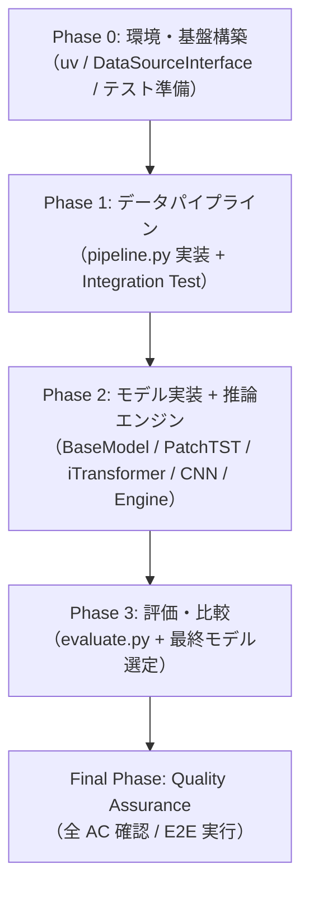
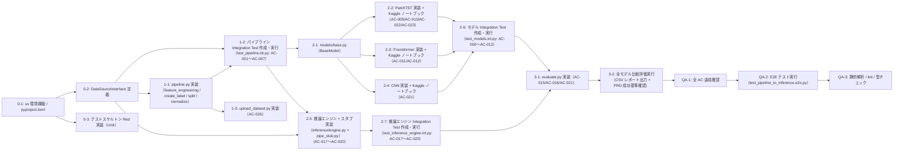

# Work Plan: USDJPY 5分足方向予測 ML システム（Pearless）実装

Created Date: 2026-04-21
Type: feature
Estimated Duration: 14〜21 days
Estimated Impact: 15+ files (新規プロジェクト全体)
Related Issue/PR: N/A

## Related Documents

- Design Doc: [docs/design/fx-prediction-design.md](/home/nomu/claude_code/pearless/docs/design/fx-prediction-design.md)
- PRD: [docs/prd.md](/home/nomu/claude_code/pearless/docs/prd.md)
- ADR: docs/adr/ADR-0001-model-architecture-selection.md
- ADR: docs/adr/ADR-0002-technical-indicator-library.md

---

## Verification Strategy (from Design Doc)

### Correctness Proof Method

- **Correctness definition**:
  1. パイプライン: 同一入力 CSV から同一 numpy 配列が生成される（SHA-256 一致）、かつ AC-001〜AC-008 が全て pass
  2. モデル: 各 AC（AC-009〜AC-012）が PyTorch shape アサーションで pass
  3. 推論: 100 回連続エラーゼロ、推論時間が 100 回平均 50ms 未満（AC-017）
  4. 評価: PRD 成功基準（UP/DOWN F1 +5pt、Precision@0.8 ≥ 70%）を CSV レポートで確認
- **Verification method**:
  - Unit: 各関数に pytest テストを追加（AC 単位でテスト関数を定義）
  - Integration: `pipeline.py` の end-to-end を実 CSV サブセットで実行
  - Performance: 推論時間を `time.perf_counter` で 100 回計測
- **Verification timing**: 各 Phase 完了時にそれぞれの AC 群を一括確認

### Early Verification Point

- **First verification target**: `feature_engineering()` 関数で合成 OHLCV DataFrame を入力し、出力 shape が `(N, 16)` かつ NaN 数ゼロであることを確認
- **Success criteria**: `assert df_features.shape[1] == 16 and df_features.isna().sum().sum() == 0`
- **Failure response**: pandas-ta の API 変更や列名の不一致が原因の場合は ADR-0002 の指標 API マッピングを見直す

---

## Quality Assurance Mechanisms (from Design Doc)

| Mechanism | Enforces | Config Location | Covered Files |
|-----------|----------|-----------------|---------------|
| パイプライン冪等性（SHA-256 検証） | 同一 CSV 入力 → 同一 numpy 出力 | pipeline.py 内アサーション | pipeline.py, data/ |
| uv sync 完全再現 | 環境再現性 | pyproject.toml / uv.lock | project-wide |
| スタブ連続 100 回推論エラーゼロ | 推論エンジン安定性（AC-019） | tests/integration/test_inference_engine.int.py | inference/engine.py, inference/pipe_stub.py |
| パイプライン各ステップ後アサーション（shape・NaN 数・クラス分布） | データ品質・リーク防止 | pipeline.py 内アサーション | pipeline.py |
| モデルパラメータ数チェック（10M 以下） | CPU 推論コスト制約 | tests/integration/test_models.int.py | models/patchtst.py, models/itransformer.py, models/cnn.py |

---

## Design-to-Plan Traceability

| DD Section | DD Item | Category | Covered By Task(s) | Gap Status | Notes |
|---|---|---|---|---|---|
| Existing Codebase Analysis | `pyproject.toml` / uv 環境構築 | prerequisite | Phase 0 Task 0-1 | covered | |
| Existing Codebase Analysis | `inference/interface.py`（DataSourceInterface） | impl-target | Phase 0 Task 0-2 | covered | |
| Existing Codebase Analysis | `pipeline.py`（feature_engineering / create_label / split / normalize） | impl-target | Phase 1 Task 1-1 | covered | |
| Existing Codebase Analysis | `scripts/upload_dataset.py` | impl-target | Phase 1 Task 1-3 | covered | |
| Existing Codebase Analysis | `models/base.py`（BaseModel） | impl-target | Phase 2 Task 2-1 | covered | |
| Existing Codebase Analysis | `models/patchtst.py` + Kaggle ノートブック | impl-target | Phase 2 Task 2-2 | covered | |
| Existing Codebase Analysis | `models/itransformer.py` + Kaggle ノートブック | impl-target | Phase 2 Task 2-3 | covered | |
| Existing Codebase Analysis | `models/cnn.py` + Kaggle ノートブック | impl-target | Phase 2 Task 2-4 | covered | |
| Existing Codebase Analysis | `models/training.py`（共通学習ループ） | impl-target | Phase 2 Task 2-2〜2-4 | covered | 各モデルタスクに同梱 |
| Existing Codebase Analysis | `inference/pipe_stub.py` + `inference/engine.py` | impl-target | Phase 2 Task 2-5 | covered | |
| Existing Codebase Analysis | `evaluate.py` | impl-target | Phase 3 Task 3-1 | covered | |
| Integration Points List | DataSourceInterface 差し替え（DI） | connection-switching | Phase 2 Task 2-5 | covered | |
| Integration Points List | Kaggle Dataset 連携 | connection-switching | Phase 1 Task 1-3 | covered | |
| Integration Points List | モデル切り替え（BaseModel 抽象） | connection-switching | Phase 2 Task 2-1 | covered | |
| Contract Definitions | `run_pipeline()` シグネチャ | contract-change | Phase 1 Task 1-1 | covered | |
| Contract Definitions | `DataSourceInterface.fetch_latest_ohlcv()` | contract-change | Phase 0 Task 0-2 | covered | |
| Contract Definitions | `InferenceEngine.predict()` 戻り値 | contract-change | Phase 2 Task 2-5 | covered | |
| Verification Strategy | feature_engineering Early Verification | verification | Phase 1 Task 1-2 | covered | |
| Verification Strategy | SHA-256 冪等性確認（AC-001〜AC-008） | verification | Phase 1 Task 1-2 | covered | |
| Verification Strategy | モデル shape アサーション（AC-009〜AC-012） | verification | Phase 2 Task 2-2〜2-4 | covered | |
| Verification Strategy | 推論 100 回計測（AC-017/AC-019） | verification | Phase 2 Task 2-5 | covered | |
| Verification Strategy | 評価 CSV 確認（AC-015/AC-016） | verification | Phase 3 Task 3-2 | covered | |
| Security Considerations | Kaggle API トークン環境変数管理 / .env を .gitignore | prerequisite | Phase 0 Task 0-1 | covered | |
| CPU/GPU 切り替え設計 | `DEVICE = torch.device(...)` パターン | impl-target | Phase 2 Task 2-2〜2-4 | covered | 各モデルタスクに同梱 |
| Logging and Monitoring | `logs/training_log_{model_name}_{timestamp}.csv` | impl-target | Phase 2 Task 2-2〜2-4 | covered | AC-022/AC-023 |

---

## Objective

USDJPY 5 分足 OHLCV データから次の 5 分足方向（UP/DOWN/NEUTRAL）を予測する ML システムを新規構築する。以前の 1 分足 CNN システムの精度限界と運用コスト課題を解消し、Kaggle GPU 無料枠を活用した費用ゼロの学習パイプラインと Named Pipe スタブによる MT4 将来連携インターフェースを確立する。

## Background

- 1 分足 CNN（2 モデル構成）の精度限界（Accuracy 64〜78%）
- 複数テクニカル指標の動的相互作用をモデル化できていない
- 2 モデル構成の管理コストが高い
- GPU 学習環境の再現性が低い

---

## Risks and Countermeasures

### Technical Risks

- **Risk**: NEUTRAL クラス過剰予測（クラス不均衡）
  - **Impact**: High — UP/DOWN の F1 スコアが目標値を達成できない
  - **Countermeasure**: CrossEntropyLoss に `weight=class_weights`（UP/DOWN を重く）を適用。クラス分布を pipeline.py の各ステップ後アサーションで毎回確認

- **Risk**: NaN 処理ミスによるデータリーク
  - **Impact**: High — モデル精度が過大評価される
  - **Countermeasure**: パイプライン各ステップ後に shape・NaN 数・クラス分布のアサーションを実装。AC-004 は Integration Test で検証

- **Risk**: scaler 不整合（学習時/推論時）
  - **Impact**: High — 推論結果が破綻する
  - **Countermeasure**: `scaler.pkl` を `data/` に保存し、推論エンジンが必ず読み込む構造を強制。Integration Test で serialize/deserialize の一貫性を検証

- **Risk**: pandas-ta パフォーマンス問題（75 万行）
  - **Impact**: Medium — パイプライン 30 分以内制約を超過
  - **Countermeasure**: 処理時間を計測し、超過時はベクトル化実装への部分移行を検討

### Schedule Risks

- **Risk**: Kaggle GPU 時間不足（週 30 時間）
  - **Impact**: High — Phase 2 のモデル学習が完了できない
  - **Countermeasure**: 直近 2 年分でデバッグ完了後、全期間 commit mode 実行。fp16 混合精度で学習時間を短縮

---

## Phase Structure Diagram

---

## Task Dependency Diagram

---

## Implementation Phases

設計書の実装アプローチ: **Horizontal Slice（基盤優先）→ Vertical Slice（モデル別）のハイブリッド**

---

### Phase 0: 環境・基盤構築とテスト準備（推定コミット数: 3）

**Purpose**: 全コンポーネントの実行環境と共有インターフェースを確立し、TDD の Red 状態テストを準備する

**Strategy**: Strategy A（TDD）— テストスケルトンが提供されているため、Unit テストの Red 状態から開始する

#### Tasks

- [ ] **Task 0-1: uv プロジェクト環境構築と .gitignore 設定**
  - `pyproject.toml` 作成（Python 3.11、torch CPU 版、pandas-ta、scikit-learn、kaggle 等）
  - `uv sync` で依存関係インストール確認
  - `.gitignore`（`data/`、`logs/`、`.env`、`*.pkl`、`*.pt`、`uv.lock` の Git 管理可否確認）
  - `.env` ファイルテンプレート作成（Kaggle API トークン管理）
  - **完了条件**:
    - `uv sync` が正常終了する（AC-024）
    - `uv export --format requirements-txt` が実行できる（AC-025）
    - `.env` が `.gitignore` で除外されている

- [x] **Task 0-2: DataSourceInterface 定義（`inference/interface.py`）**
  - `DataSourceInterface` 抽象クラスを実装
  - `fetch_latest_ohlcv(n_bars: int = 60) -> pd.DataFrame` を `@abstractmethod` で定義
  - **完了条件**:
    - `DataSourceInterface` が ABC として正しく定義されている
    - サブクラスが `fetch_latest_ohlcv` を実装しないと `TypeError` が発生する

- [ ] **Task 0-3: Integration テストスケルトン Red 実装**
  - `tests/integration/test_pipeline.int.py` の fixture を実装（`synthetic_ohlcv_df`、`synthetic_ohlcv_csv`）
  - `tests/integration/test_inference_engine.int.py` の fixture を実装（`saved_scaler_path`、`mock_data_source`、`stub_model`、`minimal_patchtst_model`）
  - 各テスト関数本体は `pass` のままで `pytest --collect-only` が通ることを確認
  - **完了条件**:
    - `pytest tests/ --collect-only` でテスト関数が収集される（エラーなし）
    - テスト実行時にすべて `FAILED` または `XFAIL` になる（Red 状態）

#### Phase 0 完了基準

- [ ] `uv sync` 一コマンドで全依存関係インストール完了（AC-024）
- [ ] `DataSourceInterface` が正しく定義され、サブクラス化できる
- [ ] Integration テストスケルトンが pytest で収集される（Red 状態）

---

### Phase 1: データパイプライン実装（推定コミット数: 4）

**Purpose**: 全モデルの学習データを生成する基盤パイプラインを実装し、Integration Test で検証する

**Verification**: Early Verification Point — `feature_engineering()` の出力 shape `(N, 16)` かつ NaN ゼロ

#### Tasks

- [x] **Task 1-1: `pipeline.py` 実装（feature_engineering / create_label / split / normalize）**
  - `feature_engineering(df: pd.DataFrame) -> pd.DataFrame` — 16 特徴量計算（pandas-ta）+ 先頭 NaN 行ドロップ + ステップ後アサーション
  - `create_label(df: pd.DataFrame, horizon: int = 1, threshold: float | None = None) -> np.ndarray` — 3 クラスラベル生成（UP=0, DOWN=1, NEUTRAL=2）
  - `create_windows(features: np.ndarray, labels: np.ndarray, window_size: int = 60) -> tuple[np.ndarray, np.ndarray]`
  - `split_time_series(X: np.ndarray, y: np.ndarray, ratios: list[float] = [0.70, 0.15, 0.15]) -> tuple[...]`
  - `normalize(X_train, X_val, X_test, scaler_path: str) -> tuple[np.ndarray, np.ndarray, np.ndarray]` — train-only fit + scaler.pkl 保存
  - `run_pipeline(csv_path: str, output_dir: str, ...) -> None` — SHA-256 冪等性確認付き end-to-end 実行
  - **完了条件（3 要素）**:
    - Implementation: `uv run python pipeline.py` が正常終了し `data/` に 7 ファイルが生成される
    - Quality: 各ステップ後アサーション（shape・NaN・クラス分布）がパスする
    - Integration: `feature_engineering()` の出力が shape `(N, 16)` かつ NaN ゼロ（Early Verification Point）

- [ ] **Task 1-2: パイプライン Integration Test 作成・実行（test_pipeline.int.py: AC-001〜AC-007）**
  - テスト対象ファイル: `tests/integration/test_pipeline.int.py`
  - `test_pipeline_generates_all_required_output_files`（AC-001）実装
  - `test_pipeline_output_x_arrays_have_correct_shape`（AC-002）実装
  - `test_time_series_split_preserves_temporal_order_and_ratios`（AC-003）実装
  - `test_normalizer_fits_only_on_train_data_not_val_or_test`（AC-004）実装
  - `test_feature_engineering_produces_16_features_with_no_nan`（AC-005）実装
  - `test_label_generation_uses_quantile_075_threshold_when_not_specified`（AC-007）実装
  - SHA-256 冪等性テスト（2 回実行して同一ハッシュを確認）追加
  - **完了条件（3 要素）**:
    - Implementation: 6 テスト関数すべてが実装済み
    - Quality: `pytest tests/integration/test_pipeline.int.py` が全 pass（テスト解決: 6/6）
    - Integration: AC-001〜AC-007 が一括確認済み

- [x] **Task 1-3: `scripts/upload_dataset.py` 実装（AC-026）**
  - `kaggle datasets create` CLI を使った Kaggle Dataset アップロード
  - アップロード完了後に Dataset ページ URL をコンソール出力
  - Kaggle API トークンを環境変数から読み込む（ハードコード禁止）
  - **完了条件**:
    - スクリプトが引数なしで usage を表示し、`--dry-run` オプションで API 呼び出しをスキップできる
    - Kaggle API mock テストでアップロード完了 URL が出力される（AC-026）

#### Phase 1 完了基準

- [ ] `tests/integration/test_pipeline.int.py` 全 6 テスト pass（テスト解決: 6/6）
- [ ] SHA-256 冪等性確認（同一 CSV → 同一 numpy 配列）
- [ ] AC-001〜AC-008 達成確認

---

### Phase 2: モデル実装・推論エンジン（推定コミット数: 8）

**Purpose**: PatchTST / iTransformer / CNN の 3 モデルと推論エンジンを実装し、Integration Test で検証する。Kaggle ノートブックを用いて実際の学習も実行する。

#### Tasks

- [x] **Task 2-1: `models/base.py`（BaseModel 抽象クラス）実装**
  - `BaseModel(nn.Module)` — `forward(x: torch.Tensor) -> torch.Tensor` の抽象インターフェース
  - 入出力 shape 契約（B, 60, 16）→（B, 3）をクラス定数として定義
  - **完了条件**:
    - `BaseModel` が正しく定義され、具象クラスが `forward` を実装しないと `NotImplementedError`

- [ ] **Task 2-2: PatchTST 実装 + Kaggle ノートブック作成（AC-009/AC-010/AC-013/AC-014/AC-022/AC-023）**
  - `models/patchtst.py` — RevIN + パッチ化 Transformer（patch_len=6, stride=6, d_model=128, n_heads=8, n_layers=3, dim_ff=256）
  - `models/training.py` — 共通学習ループ（CrossEntropyLoss[class_weights] / AdamW / CosineAnnealingWarmRestarts / early_stopping / CSV ログ）
  - `notebooks/train_patchtst.ipynb` — commit mode 対応、`/kaggle/working/` チェックポイント保存
  - CPU/GPU 切り替え（`DEVICE = torch.device("cuda" if torch.cuda.is_available() else "cpu")`）
  - **完了条件（3 要素）**:
    - Implementation: `PatchTST(batch=4, seq=60, feat=16).forward(x).shape == (4, 3)` かつ softmax 合計≈1.0
    - Quality: パラメータ数 ≤ 10M 確認。RevIN モジュールが存在する
    - Integration: `notebooks/train_patchtst.ipynb` が commit mode で実行完了し `best_model.pt` が生成される

- [ ] **Task 2-3: iTransformer 実装 + Kaggle ノートブック作成（AC-011/AC-012）**
  - `models/itransformer.py` — 転置操作（B,60,16）→（B,16,60）+ 特徴量軸 Attention（RevIN 適用しない）
  - `notebooks/train_itransformer.ipynb` — commit mode 対応
  - **完了条件（3 要素）**:
    - Implementation: `iTransformer(batch=4, seq=60, feat=16).forward(x).shape == (4, 3)` かつ転置操作が forward 内で行われる
    - Quality: パラメータ数 ≤ 10M、RevIN モジュールが存在しない（ADR-0001 準拠）
    - Integration: Kaggle ノートブックが commit mode で実行完了

- [ ] **Task 2-4: CNN ベースライン実装 + Kaggle ノートブック作成（AC-021）**
  - `models/cnn.py` — 5 分足対応 CNN ベースライン
  - `notebooks/train_cnn.ipynb` — commit mode 対応
  - **完了条件**:
    - `CNNModel(batch=4, seq=60, feat=16).forward(x).shape == (4, 3)`
    - Kaggle ノートブックが commit mode で実行完了

- [ ] **Task 2-5: 推論エンジン + Named Pipe スタブ実装（AC-017〜AC-020）**
  - `inference/pipe_stub.py` — `DataSourceInterface` を継承、ダミー OHLCV データ生成
  - `inference/engine.py` — scaler.pkl ロード、feature_engineering 適用、モデル推論、時間計測
  - `InferenceEngine.predict()` — `{"signal": str, "probabilities": dict, "inference_ms": float}` を返す
  - **完了条件（3 要素）**:
    - Implementation: `NamedPipeStub()` 経由で推論が成功し、シグナルと確率 3 値が返る（AC-018）
    - Quality: 推論時間 100 回平均 50ms 未満（AC-017）
    - Integration: `DataSourceInterface` の差し替えがインターフェース変更なしで可能（AC-020）

- [ ] **Task 2-6: モデル Integration Test 作成・実行（test_models.int.py: AC-009〜AC-012）**
  - テスト対象ファイル: `tests/integration/test_models.int.py`
  - `test_patchtst_forward_output_shape_and_softmax`（AC-009/AC-010）実装
  - `test_patchtst_parameter_count_under_10_million` 実装
  - `test_itransformer_forward_output_shape_and_transpose`（AC-011/AC-012）実装
  - `test_itransformer_has_no_revin_module`（ADR-0001 準拠）実装
  - `test_all_models_implement_base_model_interface`（parametrize）実装
  - **完了条件**:
    - `pytest tests/integration/test_models.int.py` が全 pass（テスト解決: 5/5）
    - AC-009〜AC-012 達成確認

- [ ] **Task 2-7: 推論エンジン Integration Test 作成・実行（test_inference_engine.int.py: AC-017〜AC-020）**
  - テスト対象ファイル: `tests/integration/test_inference_engine.int.py`
  - `test_inference_engine_returns_signal_and_three_probabilities`（AC-018）実装
  - `test_inference_engine_completes_within_50ms_average_over_100_runs`（AC-017）実装
  - `test_stub_100_consecutive_predictions_produce_no_errors`（AC-019）実装
  - `test_inference_engine_accepts_any_data_source_interface_subclass`（AC-020）実装
  - fixture `saved_scaler_path`, `stub_model`, `minimal_patchtst_model` 実装
  - **完了条件**:
    - `pytest tests/integration/test_inference_engine.int.py` が全 pass（テスト解決: 4/4）
    - AC-017〜AC-020 達成確認

#### Phase 2 完了基準

- [ ] `tests/integration/test_models.int.py` 全 5 テスト pass
- [ ] `tests/integration/test_inference_engine.int.py` 全 4 テスト pass
- [ ] AC-009〜AC-020 達成確認
- [ ] 3 モデルの Kaggle ノートブックが commit mode 実行完了（AC-013/AC-014）
- [ ] `best_model.pt` がダウンロード可能な状態

---

### Phase 3: 評価・比較（推定コミット数: 2）

**Purpose**: 全モデルを同一テストデータで評価し、PRD 成功基準の達成を確認する

#### Tasks

- [ ] **Task 3-1: `evaluate.py` 実装（AC-015/AC-016/AC-021）**
  - 全メトリクス計算: Accuracy / F1(UP/DOWN) / Precision(UP/DOWN) / AUC-ROC / 高信頼度的中率（prob > threshold、デフォルト 0.8）
  - `--threshold` オプション（AC-016）
  - 全モデルの結果を同一 CSV レポートに出力（CNN 列を欠損なく含む）（AC-021）
  - **完了条件（3 要素）**:
    - Implementation: `python evaluate.py --model patchtst` が CSV ファイルを出力する
    - Quality: `--threshold` オプションが高信頼度的中率の計算に反映される（AC-016）
    - Integration: 全モデルの比較 CSV に CNN 列が欠損なく存在する（AC-021）

- [ ] **Task 3-2: 全モデル比較評価実行と PRD 成功基準確認**
  - PatchTST / iTransformer / CNN を同一 `X_test.npy` / `y_test.npy` で評価
  - UP/DOWN F1 スコアが CNN ベースラインを +5pt 以上上回るか確認
  - Precision@0.8 が 70% 以上か確認
  - 評価結果を `logs/` に保存
  - **完了条件**:
    - 評価 CSV が生成され、3 モデルの比較が可能な状態（AC-015）
    - PRD 成功基準の達成状況がレポートに記載される

#### Phase 3 完了基準

- [ ] AC-015 / AC-016 / AC-021 達成確認
- [ ] 全モデル比較 CSV が出力される
- [ ] PRD 定量的成功基準の達成状況が確認される

---

### Final Phase: Quality Assurance（推定コミット数: 2）

**Purpose**: 全 AC の最終確認、E2E テスト実行、静的品質チェックを実施する

#### Tasks

- [ ] **QA-1: 全 Design Doc Acceptance Criteria 達成確認**
  - AC-001〜AC-026 の全項目を一括チェックリスト確認
  - 未達成 AC がある場合は対応タスクを追加

- [ ] **QA-2: E2E テスト実装・実行（test_pipeline_to_inference.e2e.py）**
  - テスト対象ファイル: `tests/e2e/test_pipeline_to_inference.e2e.py`
  - `test_full_pipeline_to_stub_inference_end_to_end` を実装
  - fixture `synthetic_ohlcv_csv`, `minimal_patchtst_model` を実装
  - **E2E ジャーニー検証**:
    - Step 1（CLI 境界 1）: `run_pipeline()` → `scaler.pkl` + numpy 配列生成確認
    - Step 2（CLI 境界 2）: `InferenceEngine` + `NamedPipeStub` → シグナル返却確認
    - State carry 確認: Step 1 生成の `scaler.pkl` が Step 2 で正しくロードされる
  - **完了条件**:
    - `pytest tests/e2e/test_pipeline_to_inference.e2e.py` が全 pass
    - 2 ステップのジャーニーが完結する

- [ ] **QA-3: 静的解析・lint・型チェック・カバレッジ**
  - `ruff check .`（または相当の linter）— エラーゼロ
  - `mypy`（または相当の型チェッカー）— エラーゼロ（`any` 型使用禁止の確認）
  - `pytest --cov` — カバレッジ 70% 以上
  - `uv sync` による環境再現性最終確認（AC-024）
  - `uv export --format requirements-txt` による Kaggle 向け requirements.txt 生成確認（AC-025）
  - セキュリティ確認: Kaggle API トークンがコードにハードコードされていないことを確認

- [ ] **QA-4: ドキュメント最終確認**
  - コードコメントに設計書との対応関係が明示されていること（PRD 定性的成功基準）
  - `README.md`（または相当のドキュメント）に使用手順が記載されていること

#### Final Phase 完了基準

- [ ] `pytest tests/e2e/test_pipeline_to_inference.e2e.py` 全 pass
- [ ] `pytest tests/` 全 pass（Unit + Integration + E2E）
- [ ] カバレッジ 70% 以上
- [ ] 静的解析エラーゼロ（lint / 型チェック）
- [ ] AC-001〜AC-026 全項目達成確認
- [ ] PRD 成功基準（定量・定性）達成確認

---

## Completion Criteria

- [ ] Phase 0〜3 および Final Phase の全タスク完了
- [ ] `pytest tests/` 全 pass（Integration: 15/15、E2E: 1/1）
- [ ] AC-001〜AC-026 全項目達成
- [ ] 静的品質チェック完了（エラーゼロ）
- [ ] 3 モデルの Kaggle 学習が commit mode で完了し `best_model.pt` がダウンロード可能
- [ ] PRD 定量的成功基準（F1 +5pt、Precision@0.8 ≥ 70%、推論 50ms 未満）達成または結果確認済み
- [ ] ユーザーレビュー承認取得

---

## Progress Tracking

### Phase 0: 環境・基盤構築とテスト準備
- Start: -
- Complete: -
- Notes: -

### Phase 1: データパイプライン実装
- Start: -
- Complete: -
- Notes: -

### Phase 2: モデル実装・推論エンジン
- Start: -
- Complete: -
- Notes: -

### Phase 3: 評価・比較
- Start: -
- Complete: -
- Notes: -

### Final Phase: Quality Assurance
- Start: -
- Complete: -
- Notes: -

---

## Notes

### テストスケルトンファイル一覧

- **Integration Tests**（実装と同時に作成・実行）:
  - `tests/integration/test_pipeline.int.py` — AC-001〜AC-007 対応（6 テスト関数）
  - `tests/integration/test_inference_engine.int.py` — AC-017〜AC-020 対応（4 テスト関数）
  - `tests/integration/test_models.int.py` — AC-009〜AC-012 対応（5 テスト関数）
- **E2E Tests**（全実装完了後に実行）:
  - `tests/e2e/test_pipeline_to_inference.e2e.py` — CSVロード→パイプライン→スタブ推論の 2 段階 CLI 境界を跨ぐジャーニー（1 テスト関数）

### 実行環境の注意点

- ローカル（WSL2）: PyTorch CPU 版（`--index-url https://download.pytorch.org/whl/cpu`）
- Kaggle: PyTorch GPU 版（T4 × 2）、同一コードで `DEVICE` 自動切り替え
- Integration Test の `test_inference_engine_completes_within_50ms_average_over_100_runs` は CI 環境の負荷によりフレーキーになりうる。CI 時は 100ms 以下を代替基準とする（テストスケルトンのコメント参照）

### wandb 禁止事項

設計書 v3 に wandb 推奨記述があるが、PRD の Won't Have 決定に従い **wandb を完全に除外**する。コードへの一切の含有を禁止し、代替として CSV ログのみを使用する。
