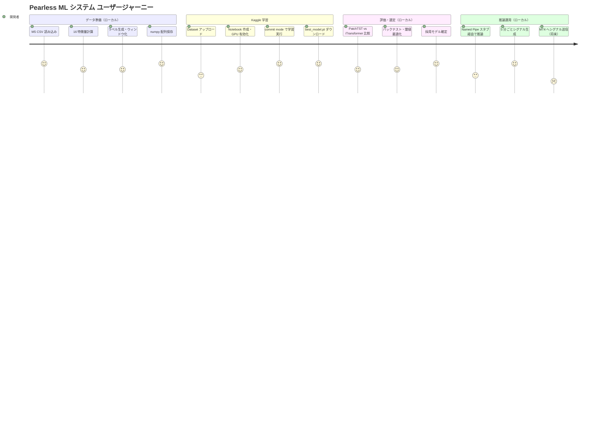
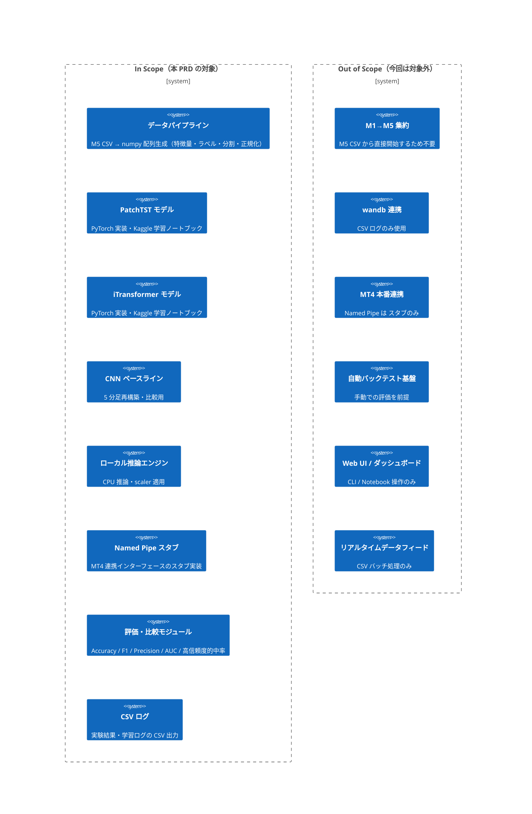

# PRD: USDJPY 5分足方向予測 ML システム（Pearless）

## Overview

### One-line Summary

USDJPY の 5 分足データから次の 5 分足の方向（UP/DOWN/NEUTRAL）を予測する ML システムを、uv を使った Python プロジェクトとして新規構築する。

### Background

以前の CNN ベースシステム（1 分足・振れ幅分類・精度 64〜78%）の知見を活かしつつ、最新の Transformer 系アーキテクチャ（PatchTST / iTransformer）に移行することで、自動売買エントリーシグナルの精度向上を目指す。

主な課題:
- 1 分足ベースの CNN では短期ノイズの影響が大きく、予測の安定性に限界がある
- 2 モデル構成（HIGH 用 / LOW 用）の運用コストが高い
- Kaggle GPU（週 30 時間無料）を活用した費用ゼロの学習パイプラインを整備する必要がある
- MT4 との連携（Named Pipe）のスタブ実装から始め、将来の本番運用への移行を見据えた設計が必要

---

## User Stories

### Primary Users

データサイエンティスト兼トレーダーである開発者本人（1 名）。ローカル（WSL2 + uv, CPU）でデータパイプラインと推論を実行し、Kaggle GPU で学習を行う。

### User Stories

```
As a 個人トレーダー兼開発者
I want to 5分足CSVデータから学習済みモデルを生成し、次の5分足の方向を推論できるシステム
So that 自動売買のエントリーシグナルとして活用し、以前のCNNシステムより高精度なシグナルを得る
```

```
As a 個人トレーダー兼開発者
I want to KaggleのJupyterノートブックでGPU学習を完結させ、学習済みモデルをローカルにダウンロード
So that 追加コストなしでTransformer系モデルの学習を行える
```

```
As a 個人トレーダー兼開発者
I want to MT4からNamed Pipe経由でリアルタイム推論リクエストを受け付けるスタブを用意
So that 将来の本番MT4連携に向けたインターフェースを今から確立しておける
```

### Use Cases

1. **データパイプライン実行**: USDJPY_M5.csv を読み込み、16 特徴量の計算・ラベル生成・ウィンドウ化・分割・正規化を行い、`X_train.npy` 等の numpy 配列を生成する
2. **Kaggle 学習**: numpy 配列を Kaggle Dataset にアップロードし、PatchTST / iTransformer の学習ノートブックを実行（commit mode）して `best_model.pt` を取得する
3. **ローカル推論**: ダウンロードした `.pt` ファイルを使い、直近 60 本の 5 分足データから UP/DOWN/NEUTRAL を CPU で推論する
4. **Named Pipe スタブ確認**: MT4 からのデータ送信を模擬するスタブ経由で推論フローが動作することを確認する
5. **モデル比較評価**: PatchTST・iTransformer・CNN ベースラインを同一テストデータで比較し、最終採用モデルを選定する

### User Journey Diagram



### Scope Boundary Diagram



---

## Functional Requirements

### Must Have (P1 - MVP)

- [ ] **データパイプライン**: USDJPY_M5.csv を読み込み、16 特徴量の計算・ラベル生成・ウィンドウ化・時系列分割・正規化を実行し、numpy 配列として保存する
  - AC-001: `X_train.npy`, `y_train.npy`, `X_val.npy`, `y_val.npy`, `X_test.npy`, `y_test.npy`, `scaler.pkl` が正常に生成される
  - AC-002: 入力形状が `(N, 60, 16)` であること（N はサンプル数）
  - AC-003: 時系列分割が train 70% / val 15% / test 15% の順序分割で行われ、リークが発生しないこと
  - AC-004: 正規化が train データの統計量のみを使用し、val / test に同一 scaler を適用すること

- [ ] **16 特徴量の実装**: pandas-ta を使用して設計書記載の 16 特徴量（MA60 乖離率・天井度・MA20・MA10・前足比・曜日・HLO・diff_HLO_and_Average・CCI(20)・RSI(9)・振れ幅・VWAP 乖離率・BB%B・MACD ヒストグラム・ATR(14)・時間帯 sin/cos）を計算する
  - AC-005: 全 16 特徴量が NaN なしで計算完了すること（先頭の NaN 行はドロップ）
  - AC-006: 時間帯特徴量が sin/cos エンコーディング（周期 288 = 1 日の 5 分足本数）で実装されること

- [ ] **ラベル生成**: 次の 1 本先（5 分後）の終値方向を **UP(0) / DOWN(1) / NEUTRAL(2)** の 3 クラスで分類するラベルを生成する
  - AC-007: 閾値 θ がデフォルトで変動幅（`diff.abs()`）の **75 パーセンタイル値**から自動決定されること（上位 25% が UP または DOWN に分類され、残り 75% が NEUTRAL となること）
  - AC-008: 閾値を外部から指定可能であること

- [ ] **PatchTST モデル実装（PyTorch）**: 設計書の仕様（patch_len=6, stride=6, d_model=128, n_heads=8, n_layers=3, dim_ff=256, dropout=0.2）に従って実装する
  - AC-009: 入力 `(batch, 60, 16)` → 出力 `(batch, 3)` の softmax 確率が正常に出力されること
  - AC-010: RevIN が実装されていること

- [ ] **iTransformer モデル実装（PyTorch）**: 特徴量軸 Attention の仕様（d_model=128, n_heads=8, n_layers=3, dim_ff=256, dropout=0.2）に従って実装する
  - AC-011: 入力 `(batch, 60, 16)` → 出力 `(batch, 3)` の softmax 確率が正常に出力されること
  - AC-012: 転置操作 `(batch, 60, 16)` → `(batch, 16, 60)` が正しく行われること

- [ ] **Kaggle 学習ノートブック**: 共通パイプライン出力（numpy 配列）を Dataset として読み込み、学習・チェックポイント保存・ベストモデル出力を行う Jupyter ノートブックを提供する
  - AC-013: `/kaggle/working/` にエポックごとのチェックポイントが保存されること
  - AC-014: commit mode で実行完了すること（ブラウザ離脱後もバックグラウンド学習継続）

- [ ] **評価モジュール**: Accuracy・F1（UP/DOWN）・Precision（UP/DOWN）・AUC-ROC・高信頼度的中率（確率 > 0.8 での Precision）・推論時間を計測・出力する
  - AC-015: テストデータに対して全メトリクスが CSV ファイルに出力されること
  - AC-016: 高信頼度的中率の閾値（デフォルト 0.8）が設定変更可能であること

- [ ] **ローカル CPU 推論**: 学習済み `.pt` ファイルと `scaler.pkl` を読み込み、直近 60 本の 5 分足データから UP/DOWN/NEUTRAL シグナルを 50ms 以内に推論する
  - AC-017: 推論時間が 1 サンプルあたり 50ms 未満であること（WSL2 CPU 環境）
  - AC-018: シグナルとともに UP/DOWN/NEUTRAL 各確率値が出力されること

- [ ] **Named Pipe スタブ**: MT4 からのデータ受信を模擬するスタブを実装し、推論フロー全体が動作することを確認できる
  - AC-019: スタブが 5 分足 60 本分のダミーデータを生成し、推論エンジンに渡して結果を返せること
  - AC-020: 実 Named Pipe への切り替えがインターフェース変更のみで対応できる構造であること

### Should Have (P2)

- [ ] **CNN ベースライン実装**: 以前のシステムの CNN を 5 分足データで再構築し、PatchTST / iTransformer との比較基準を提供する
  - AC-021: 全メトリクス（Accuracy・F1・Precision・AUC-ROC・高信頼度的中率）が PatchTST / iTransformer と同一 CSV レポートに出力され、CNN の数値が確認できること（合否: CNN 列が欠損なく存在すること）

- [ ] **学習ログ CSV 出力**: エポックごとの train loss・val loss・val accuracy を CSV に記録する
  - AC-022: `logs/training_log_{model_name}_{timestamp}.csv` に出力されること
  - AC-023: 学習中断・再開時に中断前の CSV に新しいエポック行が追記されること（合否: 再開後のエポック行が中断前の最終行より後ろに追記され、行数が増加していること）

- [ ] **uv プロジェクト構成**: `pyproject.toml`・`uv.lock` による完全再現可能な環境を整備する
  - AC-024: `uv sync` 一コマンドで全依存関係がインストールされること
  - AC-025: `requirements.txt`（Kaggle 向け）が `uv export` で生成できること

- [ ] **Kaggle Dataset アップロードスクリプト**: `kaggle datasets create` を使った CLI スクリプトを提供する
  - AC-026: スクリプト実行で numpy 配列が Kaggle Dataset として公開されること

### Could Have (P3)

- [ ] **アブレーションスタディ支援**: 特徴量の取捨選択を試すためのパラメータ化された実験スクリプト
- [ ] **Walk-forward バックテスト**: 最終モデル選定後の時系列ウォークフォワード評価
- [ ] **混合精度学習（fp16）**: Kaggle ノートブックでの学習速度向上（約 2 倍）

### Won't Have (this release)

- **M1→M5 集約**: 入力データは M5 CSV から直接開始するため対象外
- **wandb 連携**: 実験管理は CSV ログのみとし、wandb は**スコープ外と確定**する。設計書（fx_prediction_design_v3.md）では wandb が推奨されていたが、本 PRD においてスコープ外と明示的に確定した。wandb のインストール・設定・ログ送信コードは一切含めないこと
- **MT4 本番 Named Pipe 連携**: スタブ実装のみ（本番連携は将来フェーズ）
- **Web UI / ダッシュボード**: CLI および Notebook での操作のみ
- **リアルタイムデータフィード（証券会社 API 等）**: CSV バッチ処理のみ
- **Bi-Mamba（SSM）モデル**: Linux + CUDA 必須のため除外（将来 GPU 環境整備後に再検討）

---

## Non-Functional Requirements

### Performance

- 推論時間: 1 サンプルあたり **50ms 未満**（WSL2 CPU 環境・PatchTST または iTransformer）
- データパイプライン処理時間: 10 年分（750,000 本）の全処理が **30 分以内**（ローカル CPU）
- Kaggle 学習: 全期間データ（525,000 サンプル）での 1 エポック学習が **5 分以内**（GPU T4）

### Reliability

- データパイプラインの冪等性: 同一入力 CSV に対して常に同一の numpy 配列を出力すること
- チェックポイント保存: 学習中断時に最終チェックポイントから再開できること
- 推論エラー率: スタブ経由の連続 100 回推論でエラーが 0 件であること

### Security

- API キー等の認証情報（Kaggle API トークン等）は環境変数または `.env` ファイルで管理し、コードにハードコードしないこと
- `.env` ファイルは `.gitignore` で除外すること

### Scalability

- 特徴量数（現在 16）・ウィンドウ長（現在 60）・クラス数（現在 3）がハードコードされず、設定値として変更可能な設計とすること
- 将来的に他通貨ペア（EURUSD 等）への対応拡張を阻害しない構造とすること

---

## Success Criteria

### Quantitative Metrics

1. **UP/DOWN F1 スコア**: PatchTST または iTransformer のいずれかが、CNN ベースラインの F1 スコアを **5 ポイント以上上回る**こと
   - 計測方法: `evaluate.py` を使用し、`X_test.npy` / `y_test.npy` に対してモデル別に F1 スコアを算出し、同一 CSV レポートに出力する
   - 計測タイミング: Phase 3（モデル評価完了時）にすべてのモデルを一括比較
   - CNN ベースライン F1 の想定値: 以前の 1 分足 CNN の実績（Accuracy 64〜78%）から、5 分足再構築後の UP/DOWN F1 は **0.50〜0.60 程度** を想定。実測値は Phase 3 で確定し、その値を比較基準として使用する
2. **高信頼度的中率（Precision @ prob > 0.8）**: UP または DOWN 予測において **70% 以上**の Precision を達成すること
   - 計測方法: `evaluate.py` で確率 > 0.8 のサンプルのみを抽出し Precision を算出、CSV レポートに出力する
   - 計測タイミング: Phase 3（モデル評価完了時）
3. **推論レイテンシ**: ローカル CPU で **50ms 未満** / サンプルを達成すること
   - 計測方法: 推論モジュールの単体計測（Python `time.perf_counter` を使用し 100 回平均）
   - 計測タイミング: Phase 2（推論モジュール実装完了後）
4. **データパイプライン再現性**: `uv sync` 後に `uv run python pipeline.py` で numpy 配列が**差分ゼロ**で生成されること
   - 計測方法: 生成済み配列と再生成配列の SHA-256 ハッシュ値を比較
   - 計測タイミング: Phase 1（データパイプライン実装完了後）

### Qualitative Metrics

1. Kaggle ノートブックが commit mode で最後まで実行完了し、`best_model.pt` がダウンロード可能な状態になること
2. Named Pipe スタブを使用した推論フローのデモが、コード変更なしに実行できること
3. 設計書（fx_prediction_design_v3.md）に記載されたモデル仕様と実装の対応関係が、コードコメントで明示されていること

---

## Technical Considerations

### Dependencies

- **ローカル環境**: WSL2 Ubuntu + uv（Python 3.11）+ PyTorch CPU 版 + pandas-ta
- **Kaggle 環境**: Python 3.11 + PyTorch GPU 版（T4 × 2）+ 同一ライブラリ群（`requirements.txt` 経由）
- **既存システムとの関係**: 1 分足 CNN システムとは独立した新規プロジェクト。Named Pipe インターフェースの仕様のみ将来的に引き継ぐ可能性がある

### Constraints

- GPU は Kaggle 無料枠（週 30 時間 / セッション最大 12 時間）に制限される
- ローカルはすべて CPU 処理であるため、推論モデルのパラメータ数を 10M 以下に抑えること
- pandas-ta を使用（TA-Lib は C 依存のため除外）
- uv を使用（Anaconda は除外）
- 実験管理は CSV ログのみ（wandb はスコープ外と確定。設計書では推奨されていたが本 PRD で除外を明示）

### Assumptions

- USDJPY_M5.csv が datetime・open・high・low・close・volume の 6 カラムを含む形式で提供されること
- 5 分足データの期間が 2015〜2025 年（10 年分・約 750,000 本）を想定しているが、より短期間でも動作すること
- 閾値 θ の初期値は変動幅（`diff.abs()`）の 75 パーセンタイル値とし、上位 25% が UP（クラス 0）または DOWN（クラス 1）に分類される。実データ分布に応じた調整が必要な場合は AC-008 の外部指定機能を使用する
- Named Pipe スタブは実際の MT4 との接続テストを行わず、ダミーデータによる動作確認のみとする

### Risks and Mitigation

| リスク | 影響度 | 発生確率 | 対策 |
|--------|--------|----------|------|
| Kaggle 週 30 時間枠の超過 | 高 | 中 | 最初は直近 2 年分でデバッグ後、full データで commit 実行。mixed precision (fp16) で学習時間を削減 |
| NEUTRAL クラスの過剰予測（クラス不均衡） | 高 | 高 | CrossEntropyLoss にクラス重みを適用（UP/DOWN を重く、NEUTRAL を軽く） |
| PatchTST / iTransformer が CNN を下回る | 中 | 低 | 3 モデル比較を前提とし、CNN ベースラインを保持。アブレーションスタディで特徴量を調整 |
| 特徴量の NaN 処理ミスによるデータリーク | 高 | 中 | パイプラインの各ステップ後に形状・NaN 数・クラス分布をアサーションで検証 |
| scaler の不整合（学習時と推論時で異なる変換） | 高 | 低 | `scaler.pkl` を numpy 配列と同一ディレクトリに保存し、推論時に必ず読み込む構造を強制 |
| Named Pipe スタブが将来の本番 Pipe と非互換 | 低 | 中 | 受信インターフェースを抽象化し、スタブと本番実装を差し替え可能な設計にする |

---

## Undetermined Items

（現時点では未決定項目なし。以下は確認済み事項の記録）

- 入力データ: M5 CSV から直接開始（M1→M5 集約は不要）→ **確認済み**
- エントリポイント: Jupyter 形式（Kaggle 学習前提） + 推論時は Named Pipe スタブ → **確認済み**
- Named Pipe: スタブ実装のみ → **確認済み**
- wandb: 含めない（CSV ログのみ） → **確認済み**

---

## Appendix

### References

- 設計書: `/home/nomu/claude_code/pearless/fx_prediction_design_v3.md`
- PatchTST 論文: "A Time Series is Worth 64 Words: Long-term Forecasting with Transformers" (Nie et al., 2023)
- iTransformer 論文: "iTransformer: Inverted Transformers Are Effective for Time Series Forecasting" (Liu et al., 2024)
- Kaggle Notebooks: https://www.kaggle.com/docs/notebooks

### Glossary

- **5 分足（M5）**: 5 分間の OHLCV（始値・高値・安値・終値・出来高）データ
- **OHLCV**: Open（始値）/ High（高値）/ Low（安値）/ Close（終値）/ Volume（出来高）
- **UP/DOWN/NEUTRAL**: 次の 5 分足の終値方向の 3 クラス分類ラベル。クラス番号は **UP=0、DOWN=1、NEUTRAL=2** とする
- **閾値 θ**: UP/DOWN を定義する終値変化幅の閾値。変動幅（`diff.abs()`）の **75 パーセンタイル値**を採用する（上位 25% が UP/DOWN に分類され、残り 75% が NEUTRAL となる）
- **PatchTST**: 時系列をパッチ（小ウィンドウ）に分割して Transformer に入力するアーキテクチャ
- **iTransformer**: 特徴量（変数）軸に Attention をかける逆転 Transformer アーキテクチャ
- **RevIN**: 可逆インスタンス正規化（Reversible Instance Normalization）。分布シフトへの対応
- **Named Pipe**: MT4（MetaTrader 4）と Python プロセス間のプロセス間通信手段
- **commit mode**: Kaggle の Save & Run All 機能でバックグラウンド学習を実行するモード
- **uv**: Python パッケージマネージャー。高速インストールと `uv.lock` による環境再現性が特徴
- **pandas-ta**: TA-Lib の代替となる C 依存なしのテクニカル指標ライブラリ
- **walk-forward 検証**: 時系列データを時間順に分割して複数回評価する手法

---

---

## Change History

| バージョン | 日付 | 変更内容 |
|-----------|------|---------|
| 1.0.0 | 2026-04-20 | 初版作成 |
| 1.1.0 | 2026-04-20 | レビュー指摘対応: I001（Success Criteriaへ計測方法・計測タイミング・CNNベースラインF1想定値を追記）、I002（AC-021・AC-023に合否閾値を追記）、I003（wandbのスコープ外確定を明示し設計書との差異を注記）、I004（閾値θの計算式・クラス番号を一貫して明記） |

*PRD バージョン: 1.1.0 | 作成日: 2026-04-20 | 更新日: 2026-04-20 | ステータス: Draft*
